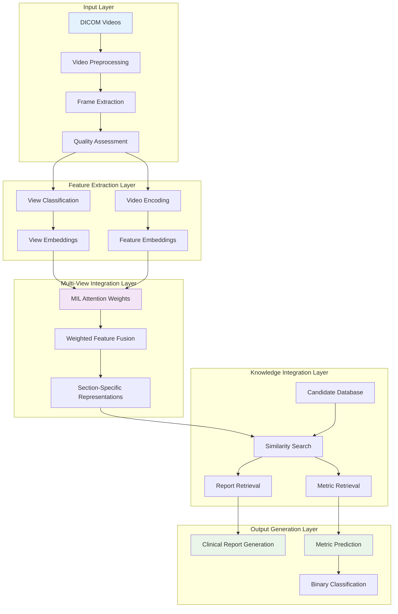
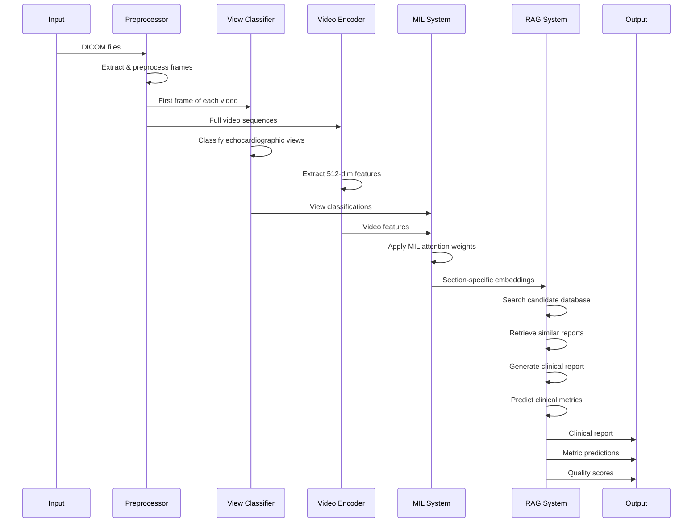

# ⚙️ EchoPrime System Architecture

This document provides a comprehensive technical overview of EchoPrime's architecture, explaining how the multi-view vision-language model works to provide expert-level echocardiography interpretation.

## 🏗️ High-Level Architecture



## 🧠 Core Components

### 1. Video Preprocessing Pipeline

#### DICOM Processing
```python
# Simplified workflow
def process_dicom(dicom_path):
    # Extract video frames from DICOM
    frames = extract_frames_from_dicom(dicom_path)
    
    # Apply ultrasound masking
    masked_frames = apply_ultrasound_mask(frames)
    
    # Standardize to 32 frames at 224x224
    processed_frames = standardize_frames(masked_frames, target_frames=32, size=(224, 224))
    
    return processed_frames
```

**Key Features:**
- **Frame Extraction**: Extracts video sequences from DICOM files
- **Ultrasound Masking**: Removes non-ultrasound regions and artifacts
- **Standardization**: Normalizes to consistent frame count and resolution
- **Quality Filtering**: Identifies and flags low-quality acquisitions

---

### 2. View Classification System

#### ConvNeXt-Based Classifier
The view classifier uses a ConvNeXt-Base architecture to identify echocardiographic views:

```python
class ViewClassifier:
    def __init__(self):
        self.model = ConvNeXt_Base(num_classes=11)
        # 11 view classes: A2C, A3C, A4C, A5C, Apical_Doppler, 
        # Doppler_Parasternal_Long, Doppler_Parasternal_Short,
        # Parasternal_Long, Parasternal_Short, SSN, Subcostal
    
    def classify_view(self, first_frame):
        # Uses only the first frame for classification
        view_logits = self.model(first_frame)
        view_prediction = torch.argmax(view_logits, dim=1)
        return view_prediction
```

**Architecture Details:**
- **Input**: First frame of each video (3 × 224 × 224)
- **Output**: One-hot encoded view classification (11 classes)
- **Accuracy**: 94.7% on validation data
- **Parameters**: ~88 million

---

### 3. Video Encoding System

#### MViT-v2-S Encoder
The main video encoder transforms echocardiogram videos into meaningful feature representations:

```python
class EchoPrimeEncoder:
    def __init__(self):
        self.encoder = MViT_v2_S(
            input_dims=(3, 32, 224, 224),
            output_dims=512
        )
    
    def encode_videos(self, video_batch):
        # Extract 512-dimensional features
        features = self.encoder(video_batch)
        return features  # Shape: [batch_size, 512]
```

**Architecture Details:**
- **Base Model**: Multiscale Vision Transformer v2 (Small)
- **Input**: 32 frames × 224×224 pixels × 3 channels
- **Output**: 512-dimensional feature vector
- **Training**: Contrastive learning on 77,426 video-report pairs
- **Parameters**: ~34.5 million

---

### 4. Multiple Instance Learning (MIL) System

#### Attention-Based Weighting
The MIL system learns which views are most informative for each anatomical structure:

```python
class MILWeighting:
    def __init__(self):
        # Load learned attention weights (15 sections × 11 views)
        self.section_weights = load_mil_weights()
    
    def apply_weights(self, features, view_classifications):
        weighted_features = []
        for section_idx in range(15):  # 15 anatomical sections
            section_weights = self.section_weights[section_idx]
            
            # Weight each video's features by its view importance
            weighted_feature = 0
            for video_idx, view_class in enumerate(view_classifications):
                weight = section_weights[view_class]
                weighted_feature += features[video_idx] * weight
            
            weighted_features.append(weighted_feature)
        
        return weighted_features
```

**Key Concepts:**
- **15 Anatomical Sections**: Left Ventricle, Right Ventricle, Mitral Valve, etc.
- **11 View Classes**: Standard echocardiographic views
- **Learned Weights**: Automatically learned attention weights (0.0 to 1.0)
- **Clinical Validation**: Weights match expert cardiologist opinions

---

### 5. Retrieval-Augmented Generation

#### Knowledge Base Integration
EchoPrime uses a large database of expert-annotated studies for report generation:

```python
class RetrievalAugmentedGeneration:
    def __init__(self):
        self.candidate_embeddings = load_candidate_embeddings()  # [N, 512]
        self.candidate_reports = load_candidate_reports()        # [N] reports
        self.candidate_labels = load_candidate_labels()          # [N] labels
    
    def generate_report(self, study_embedding):
        report_sections = []
        
        for section_idx, section_name in enumerate(self.anatomical_sections):
            # Get section-specific embedding
            section_embedding = study_embedding[section_idx]
            
            # Find most similar candidates
            similarities = cosine_similarity(section_embedding, self.candidate_embeddings)
            top_candidates = torch.topk(similarities, k=5)
            
            # Retrieve and adapt report section
            section_text = self.retrieve_section_text(top_candidates, section_name)
            report_sections.append(section_text)
        
        return "\n\n".join(report_sections)
```

**Database Contents:**
- **Candidate Embeddings**: Pre-computed 512-dim features for reference studies
- **Expert Reports**: Structured clinical reports from expert cardiologists
- **Clinical Labels**: Binary and continuous labels for various conditions
- **Size**: Thousands of high-quality reference studies

---

## 🔄 Processing Workflow

### Single Study Processing



### Batch Processing

```python
def process_batch_studies(study_directories):
    results = []
    
    for study_dir in study_directories:
        try:
            # 1. Load and preprocess DICOM files
            videos = load_dicom_videos(study_dir)
            processed_videos = preprocess_videos(videos)
            
            # 2. Classify views and extract features
            view_classifications = view_classifier(processed_videos)
            video_features = video_encoder(processed_videos)
            
            # 3. Apply MIL weighting
            weighted_features = mil_system.apply_weights(
                video_features, view_classifications
            )
            
            # 4. Generate report and predictions
            clinical_report = rag_system.generate_report(weighted_features)
            metric_predictions = rag_system.predict_metrics(weighted_features)
            
            # 5. Store results
            results.append({
                'study_name': study_dir.name,
                'report': clinical_report,
                'metrics': metric_predictions,
                'view_classifications': view_classifications,
                'quality_scores': assess_quality(processed_videos)
            })
            
        except Exception as e:
            results.append({
                'study_name': study_dir.name,
                'error': str(e),
                'status': 'failed'
            })
    
    return results
```

---

## 🎯 Multi-View Intelligence

### View-Specific Analysis Strategy

EchoPrime adapts its analysis strategy based on the available views:

```python
# Example MIL weights for Left Ventricle analysis
left_ventricle_weights = {
    'A2C': 1.0,           # Apical 2-chamber: Excellent for LV assessment
    'A4C': 0.65,          # Apical 4-chamber: Good for LV assessment  
    'A3C': 0.32,          # Apical 3-chamber: Some utility
    'Parasternal_Long': 0.49,  # Parasternal long: Moderate utility
    'Parasternal_Short': 0.71, # Parasternal short: Good for LV size
    'Subcostal': 0.65,    # Subcostal: Good alternative view
    'A5C': 0.0,           # Apical 5-chamber: Not useful for LV
    # ... other views
}
```

### Intelligent View Combination

```python
def combine_multi_view_assessment(video_features, view_classifications, anatomical_section):
    """
    Intelligently combines information from multiple views for a specific anatomical section
    """
    section_weights = mil_weights[anatomical_section]
    combined_assessment = 0
    total_weight = 0
    
    for video_idx, view_class in enumerate(view_classifications):
        view_weight = section_weights[view_class]
        if view_weight > 0:  # Only use informative views
            combined_assessment += video_features[video_idx] * view_weight
            total_weight += view_weight
    
    if total_weight > 0:
        combined_assessment /= total_weight  # Weighted average
    
    return combined_assessment
```

---

## 📊 Quality Assessment Integration

### Multi-Level Quality Control

```python
class QualityAssessment:
    def __init__(self):
        self.video_quality_model = load_quality_model()
    
    def assess_study_quality(self, videos, view_classifications):
        quality_metrics = {
            'video_scores': [],
            'view_coverage': self.assess_view_coverage(view_classifications),
            'overall_quality': 0
        }
        
        # Assess individual video quality
        for video in videos:
            score = self.video_quality_model(video)
            quality_metrics['video_scores'].append(score)
        
        # Calculate overall study quality
        quality_metrics['overall_quality'] = self.calculate_overall_quality(
            quality_metrics['video_scores'],
            quality_metrics['view_coverage']
        )
        
        return quality_metrics
    
    def assess_view_coverage(self, view_classifications):
        """Assess how well the study covers important cardiac views"""
        important_views = ['A4C', 'A2C', 'Parasternal_Long', 'Parasternal_Short']
        coverage_score = sum(1 for view in view_classifications if view in important_views)
        return coverage_score / len(important_views)
```

---

## 🔧 Performance Optimizations

### Memory Management

```python
class MemoryEfficientProcessing:
    def __init__(self, device='cuda'):
        self.device = device
        self.max_batch_size = self.determine_optimal_batch_size()
    
    def process_large_study(self, videos):
        """Process studies with many videos efficiently"""
        results = []
        
        # Process in batches to manage memory
        for i in range(0, len(videos), self.max_batch_size):
            batch = videos[i:i + self.max_batch_size]
            
            with torch.no_grad():  # Disable gradient computation
                batch_results = self.process_batch(batch)
                results.extend(batch_results)
            
            # Clear GPU cache between batches
            if self.device == 'cuda':
                torch.cuda.empty_cache()
        
        return results
```

### Parallel Processing

```python
import multiprocessing as mp
from concurrent.futures import ProcessPoolExecutor

def parallel_study_processing(study_directories, num_workers=None):
    """Process multiple studies in parallel"""
    if num_workers is None:
        num_workers = min(mp.cpu_count(), len(study_directories))
    
    with ProcessPoolExecutor(max_workers=num_workers) as executor:
        futures = [
            executor.submit(process_single_study, study_dir)
            for study_dir in study_directories
        ]
        
        results = []
        for future in futures:
            try:
                result = future.result(timeout=300)  # 5-minute timeout
                results.append(result)
            except Exception as e:
                results.append({'error': str(e), 'status': 'failed'})
    
    return results
```

---

## 🔬 Clinical Decision Making

### ROC Threshold Application

```python
class ClinicalDecisionMaking:
    def __init__(self):
        self.roc_thresholds = load_roc_thresholds()
    
    def make_binary_predictions(self, continuous_predictions):
        """Convert continuous probabilities to binary clinical decisions"""
        binary_predictions = {}
        
        for condition, probability in continuous_predictions.items():
            threshold = self.roc_thresholds.get(condition, 0.5)
            binary_predictions[condition] = probability > threshold
        
        return binary_predictions
    
    def generate_clinical_impression(self, binary_predictions, continuous_predictions):
        """Generate clinical impression based on predictions"""
        significant_findings = []
        
        for condition, is_present in binary_predictions.items():
            if is_present:
                confidence = continuous_predictions[condition]
                significance = self.assess_clinical_significance(condition, confidence)
                significant_findings.append((condition, significance))
        
        return self.format_clinical_impression(significant_findings)
```

---

## 🚀 Scalability Considerations

### Distributed Processing

```python
class DistributedEchoPrime:
    def __init__(self, num_gpus=1):
        self.num_gpus = num_gpus
        self.models = self.initialize_distributed_models()
    
    def process_large_dataset(self, study_directories):
        """Process large datasets across multiple GPUs"""
        # Distribute studies across available GPUs
        gpu_assignments = self.distribute_workload(study_directories)
        
        results = []
        for gpu_id, assigned_studies in gpu_assignments.items():
            gpu_results = self.process_on_gpu(assigned_studies, gpu_id)
            results.extend(gpu_results)
        
        return results
```

### Cloud Deployment

```python
# Example cloud deployment configuration
class CloudEchoPrime:
    def __init__(self, cloud_config):
        self.storage_client = initialize_cloud_storage(cloud_config)
        self.compute_client = initialize_cloud_compute(cloud_config)
    
    def process_cloud_study(self, study_path):
        """Process studies stored in cloud storage"""
        # Download study data
        local_path = self.storage_client.download(study_path)
        
        # Process locally
        results = self.process_study(local_path)
        
        # Upload results
        results_path = self.storage_client.upload_results(results)
        
        # Cleanup local files
        self.cleanup_local_files(local_path)
        
        return results_path
```

---

## 📈 Monitoring and Logging

### Performance Metrics

```python
class PerformanceMonitor:
    def __init__(self):
        self.metrics = {
            'processing_times': [],
            'memory_usage': [],
            'gpu_utilization': [],
            'error_rates': {}
        }
    
    def log_processing_metrics(self, study_name, processing_time, memory_peak):
        """Log performance metrics for monitoring"""
        self.metrics['processing_times'].append({
            'study': study_name,
            'time': processing_time,
            'timestamp': datetime.now()
        })
        
        self.metrics['memory_usage'].append({
            'study': study_name,
            'peak_memory': memory_peak,
            'timestamp': datetime.now()
        })
```

---

This architecture enables EchoPrime to provide expert-level echocardiography interpretation by intelligently combining multi-view information, leveraging learned clinical knowledge, and maintaining high performance across diverse clinical scenarios.
