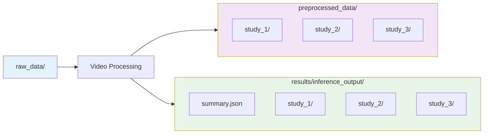
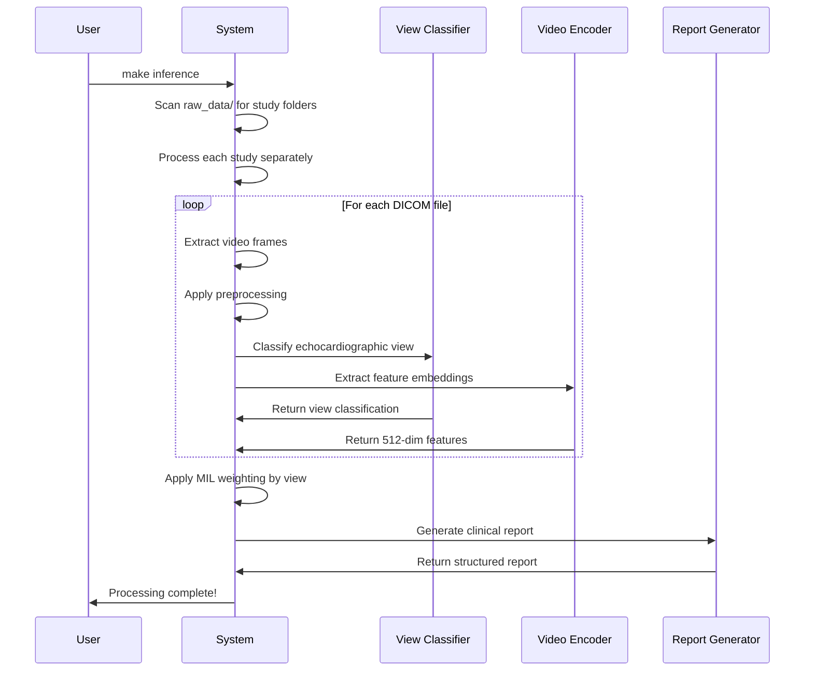

# 🚀 Getting Started with EchoPrime

This guide will walk you through setting up and running your first comprehensive echocardiography analysis with EchoPrime.

## 📋 Prerequisites

- **Python 3.8-3.12** with Poetry package manager
- **Git** for cloning repositories
- **CUDA-compatible GPU** (optional, but recommended for faster processing)
- **At least 8GB RAM** for model inference
- **DICOM echo files** to analyze

## 🛠️ Installation & Setup

### Step 1: Environment Setup

```bash
# Navigate to the echoprime directory
cd models.echoprime

# Initialize Poetry environment and install dependencies
make init
```

This command will:
- Install all Python dependencies via Poetry
- Create necessary directories (`raw_data`, `preprocessed_data`, `results`, `weights`, `training_data`)

### Step 2: Download Model Weights

```bash
# Download pre-trained model weights and embeddings
make download-weights
```

This downloads:
- `echo_prime_encoder.pt` - Main video encoder model (~138MB)
- `view_classifier.ckpt` - View classification model (~350MB)
- `candidates_data/` - Knowledge base for report generation (~500MB)
- `candidate_embeddings_p1.pt` & `candidate_embeddings_p2.pt` - Pre-computed embeddings

**Note**: Downloads are ~1GB total and may take several minutes.

## 📁 Data Organization

### Directory Structure

EchoPrime expects your DICOM files to be organized in study folders:

```
raw_data/                                    # Your input directory
├── patient_001_study_001/                   # One folder per study
│   ├── apical_4ch.dcm                      # DICOM files
│   ├── apical_2ch.dcm
│   ├── parasternal_long.dcm
│   └── subcostal.dcm
├── patient_002_study_001/
│   ├── apical_4ch.dcm
│   ├── parasternal_short.dcm
│   └── suprasternal.dcm
└── patient_003_study_002/
    ├── apical_4ch.dcm
    ├── apical_3ch.dcm
    └── parasternal_long.dcm
```

### Key Organization Rules

1. **One folder per study**: Each folder should contain DICOM files from the same patient study session
2. **Descriptive folder names**: Use meaningful names that help identify the patient and study
3. **DICOM files only**: Place only `.dcm` files in these folders
4. **Multiple views encouraged**: Include various echocardiographic views for comprehensive analysis

### Data Flow Diagram



## 🏃‍♂️ Running Your First Analysis

### Quick Start Command

```bash
# Run EchoPrime analysis on all DICOM files in raw_data/
make inference
```

This single command will:
1. Process all DICOM files in `raw_data/`
2. Extract and save processed video frames to `preprocessed_data/`
3. Run multi-view AI analysis
4. Generate comprehensive clinical reports in `results/inference_output/`

### What Happens During Processing



### Expected Output

After running `make inference`, you'll see:

```
🧹 Cleaning results and preprocessed_data for clean run...
✅ Created fresh directories
Using device: cuda
Loading EchoPrime encoder from weights/echo_prime_encoder.pt...
Loading view classifier from weights/view_classifier.ckpt...
Loading candidate data for report generation...
Model loaded successfully!

Found 3 study folders to process: ['patient_001_study_001', 'patient_002_study_001', 'patient_003_study_002']

Processing study: patient_001_study_001
Found 4 DICOM files
Processing: 100%|████████████| 4/4 [00:15<00:00,  3.75s/it]
Generated comprehensive clinical report

Processing study: patient_002_study_001
Found 3 DICOM files
Processing: 100%|████████████| 3/3 [00:12<00:00,  4.00s/it]
Generated comprehensive clinical report

================================================================================
ECHOPRIME ANALYSIS SUMMARY
================================================================================
Total studies processed: 3
Successful: 3
Failed: 0
Total DICOM files processed: 10

✓ patient_001_study_001        4 files    Report generated
✓ patient_002_study_001        3 files    Report generated  
✓ patient_003_study_002        3 files    Report generated

Detailed results saved to: results/inference_output
```

## 📊 Understanding Your Results

### Result Directory Structure

```
results/inference_output/
├── summary.json                           # Overall summary across all studies
├── patient_001_study_001/
│   ├── clinical_report.txt               # Generated clinical report
│   ├── metrics_predictions.json          # Predicted clinical metrics
│   ├── view_classifications.json         # Identified views per video
│   ├── quality_scores.json              # Video quality assessments
│   └── processing_log.txt               # Detailed processing information
├── patient_002_study_001/
│   └── ...
└── patient_003_study_002/
    └── ...
```

### Clinical Report Structure

**clinical_report.txt** contains a comprehensive structured report:

```
ECHOCARDIOGRAM REPORT

LEFT VENTRICLE:
The left ventricle demonstrates normal size and systolic function. 
Estimated ejection fraction is 60-65%. No regional wall motion 
abnormalities are identified.

RIGHT VENTRICLE:
The right ventricle appears normal in size with normal systolic function.

LEFT ATRIUM:
The left atrium is normal in size.

MITRAL VALVE:
The mitral valve appears structurally normal with no significant 
regurgitation or stenosis.

AORTIC VALVE:
The aortic valve is trileaflet with normal opening and no significant 
regurgitation or stenosis.

[... continues for all 15 anatomical sections]

IMPRESSION:
Normal echocardiogram with preserved left ventricular systolic function.
```

### Metrics Predictions

**metrics_predictions.json** contains quantitative predictions:

```json
{
  "ejection_fraction": 62.5,
  "left_ventricle_size": "normal",
  "aortic_stenosis": 0.05,
  "mitral_regurgitation": 0.12,
  "pacemaker_present": 0.02,
  "quality_metrics": {
    "overall_study_quality": 0.78,
    "usable_views": 4,
    "total_views": 4
  }
}
```

### View Classifications

**view_classifications.json** shows identified views:

```json
{
  "apical_4ch.dcm": {
    "predicted_view": "A4C",
    "confidence": 0.95,
    "quality_score": 0.82
  },
  "apical_2ch.dcm": {
    "predicted_view": "A2C", 
    "confidence": 0.91,
    "quality_score": 0.75
  },
  "parasternal_long.dcm": {
    "predicted_view": "Parasternal_Long",
    "confidence": 0.88,
    "quality_score": 0.69
  }
}
```

## 🔍 Advanced Options

### Custom Output Directory

```bash
# Specify custom output directory
poetry run python -m inference.inference --data_dir ./raw_data --output ./custom_results
```

### Single Study Processing

```bash
# Process only a specific study folder
poetry run python -m inference.inference --data_dir ./raw_data/patient_001_study_001 --output ./results/single_study
```

### GPU vs CPU Processing

```bash
# Force CPU processing (if GPU issues)
poetry run python -m inference.inference --device cpu

# Force GPU processing
poetry run python -m inference.inference --device cuda
```

### Quality Threshold Adjustment

```bash
# Use stricter quality filtering (default varies by finding)
poetry run python -m inference.inference --min_quality 0.5
```

## 🎨 Visualization and Analysis

### Generate Comprehensive Visualizations

```bash
# Create detailed charts and analysis
make visualize
```

This creates additional visualizations in `results/visualization_output/`:
- Study quality comparisons
- View distribution analysis
- Metric prediction summaries
- Processing time statistics

### Interactive Analysis with Jupyter

```bash
# Launch interactive Jupyter notebook
make jupyter
```

Access the notebook at `http://localhost:8888` to:
- Explore results interactively using `EchoPrimeDemo.ipynb`
- Visualize view classifications with `View-Classification-Demo.ipynb`
- Create custom analysis workflows
- Generate publication-ready figures

## 🐛 Troubleshooting Common Issues

### Issue: "No DICOM files found"

**Solution**: Check your directory structure
```bash
# Verify your raw_data structure
ls -la raw_data/
ls -la raw_data/*/
```

### Issue: "CUDA out of memory"

**Solutions**:
```bash
# Use CPU instead
poetry run python -m inference.inference --device cpu

# Or reduce batch size (edit inference.py)
```

### Issue: "Model weights not found"

**Solution**: Re-download weights
```bash
make download-weights
```

### Issue: "Poor quality videos affecting results"

**Solution**: Check quality scores and filter
```bash
# Review quality scores in results
cat results/inference_output/study_name/quality_scores.json

# Use higher quality threshold
poetry run python -m inference.inference --min_quality 0.6
```

### Issue: "Green-tinted processed images"

**Solution**: Ensure correct dependencies
```bash
# Reinstall with Poetry
make init
```

## 📈 Performance Optimization

### Processing Speed Tips

1. **Use GPU**: Ensure CUDA is available for 5-10x speedup
2. **Organize data**: Keep DICOM files in separate study folders
3. **Clean directories**: Remove non-DICOM files from raw_data/
4. **Monitor resources**: Watch RAM usage for large datasets

### Expected Processing Times

| Dataset Size | GPU Time | CPU Time |
|--------------|----------|----------|
| 1 study (4 videos) | ~15 seconds | ~1 minute |
| 5 studies (20 videos) | ~1 minute | ~5 minutes |
| 10 studies (40 videos) | ~2 minutes | ~10 minutes |
| 50 studies (200 videos) | ~10 minutes | ~45 minutes |

## 🎯 Next Steps

### For Clinical Users
1. **Review Reports**: Examine the generated clinical reports
2. **Validate Findings**: Compare with manual interpretations
3. **Integrate Workflow**: Incorporate into clinical practice

### For Researchers
1. **Batch Processing**: Set up automated processing pipelines
2. **Custom Analysis**: Use the Python API for specific research questions
3. **Data Export**: Extract metrics for statistical analysis

### For Developers
1. **API Integration**: Use EchoPrime in custom applications
2. **Model Customization**: Fine-tune on your specific data
3. **Pipeline Extension**: Add custom preprocessing or post-processing

## 📚 Additional Resources

- **[System Architecture](ARCHITECTURE.md)**: Technical details of the EchoPrime system
- **[Training Guide](TRAINING.md)**: How to train and fine-tune models
- **[Model Weights Guide](MODEL_WEIGHTS_EXPLAINED.md)**: Understanding the AI components
- **[Command Reference](COMMAND_REFERENCE.md)**: Complete command documentation
- **[DICOM Processing](README_DICOM_UNPACKER.md)**: Advanced DICOM handling

## 🔬 Understanding EchoPrime's Approach

### Multi-View Intelligence

Unlike traditional single-view models, EchoPrime:

1. **Identifies Views**: Automatically classifies each video into one of 11 standard echocardiographic views
2. **Applies Weights**: Uses learned attention weights to focus on the most informative views for each anatomical structure
3. **Combines Information**: Intelligently integrates information from multiple views to create comprehensive assessments
4. **Generates Reports**: Uses retrieval-augmented generation to produce clinically accurate reports

### Clinical Validation

EchoPrime has been validated to achieve:
- **Expert-level accuracy** on comprehensive echocardiogram interpretation
- **Consistent performance** across different ultrasound devices and operators
- **Robust predictions** even with incomplete view sets

---

**Congratulations!** 🎉 You've successfully run your first EchoPrime analysis. Check out the [System Architecture](ARCHITECTURE.md) to learn more about how the multi-view intelligence works under the hood.
