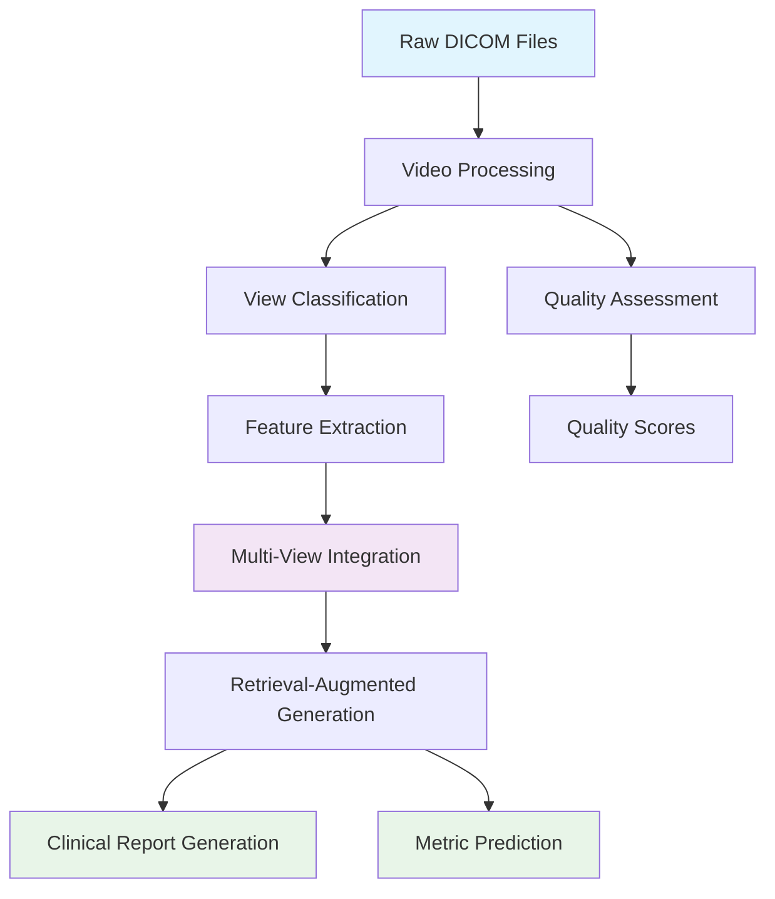
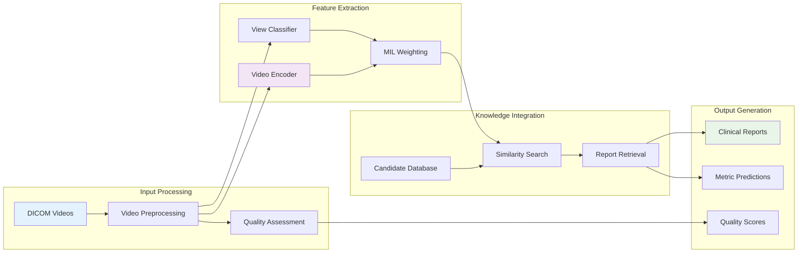
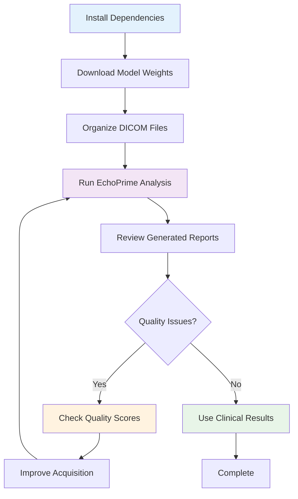

# EchoPrime Documentation

Welcome to the comprehensive documentation for EchoPrime - a multi-video view-informed vision-language model for comprehensive echocardiography interpretation.

## 🎯 What is EchoPrime?

EchoPrime is a state-of-the-art AI system that automatically analyzes echocardiogram videos to generate comprehensive clinical reports and predict cardiac metrics. Unlike traditional single-view models, EchoPrime intelligently combines information from multiple echocardiographic views to provide expert-level cardiac assessments comparable to experienced cardiologists.

## 📋 Quick Start

### 1. Setup Environment
```bash
# Initialize Poetry environment and download model weights
make init
make download-weights
```

### 2. Prepare Your Data
Place your DICOM files in the `raw_data/` directory:
```
raw_data/
├── patient_001_study_001/
│   ├── apical_4ch.dcm
│   ├── apical_2ch.dcm
│   └── parasternal_long.dcm
└── patient_002_study_001/
    ├── apical_4ch.dcm
    └── subcostal.dcm
```

### 3. Run EchoPrime Analysis
```bash
# Run inference on all DICOM files
make inference
```

### 4. View Results
Check the results in:
- `preprocessed_data/` - Extracted and processed video frames
- `results/inference_output/` - Generated reports and clinical predictions

## 📊 System Overview



## 📚 Documentation Structure

### Core Guides
- **[🚀 Getting Started Guide](GETTING_STARTED.md)** - Complete setup and first run
- **[⚙️ System Architecture](ARCHITECTURE.md)** - Technical system overview and components
- **[🎓 Training Guide](TRAINING.md)** - Model training and fine-tuning
- **[🔧 DICOM Processing](README_DICOM_UNPACKER.md)** - DICOM file handling and preprocessing

### Reference Materials
- **[📖 Command Reference](COMMAND_REFERENCE.md)** - All available commands and options
- **[📁 Project Structure](STRUCTURE.md)** - Project organization and file layout
- **[🔍 Model Weights Guide](MODEL_WEIGHTS_EXPLAINED.md)** - Understanding model components
- **[❗ Troubleshooting Guide](TROUBLESHOOTING.md)** - Common issues and solutions

## 🎯 Key Features

### 🧠 Multi-View Intelligence
- **View-Informed Analysis**: Automatically identifies echocardiographic views and applies appropriate interpretation strategies
- **MIL Weighting**: Uses learned attention weights to focus on the most informative views for each cardiac structure
- **Comprehensive Assessment**: Analyzes 15 different anatomical sections using optimal view combinations

### 🤖 Advanced AI Architecture
- **Vision-Language Model**: Combines video understanding with natural language generation
- **Retrieval-Augmented Generation**: Uses a knowledge base of expert reports for accurate clinical descriptions
- **Multi-Scale Analysis**: Processes temporal dynamics and spatial features simultaneously

### 📋 Clinical Report Generation
- **Structured Reports**: Generates comprehensive reports covering all major cardiac structures
- **Metric Prediction**: Predicts quantitative measurements and binary clinical findings
- **Expert-Level Accuracy**: Performance comparable to experienced cardiologists

### 🔍 Quality Assessment
- **Automatic Quality Scoring**: Evaluates video quality to ensure reliable analysis
- **View Classification**: Identifies 11 different echocardiographic views automatically
- **Error Detection**: Flags problematic studies that may require manual review

## 🏗️ Architecture Overview



## 🎯 Use Cases

### 🏥 Clinical Applications
- **Automated Reporting**: Generate comprehensive echocardiogram reports automatically
- **Quality Control**: Ensure consistent interpretation across different operators and devices
- **Workflow Optimization**: Reduce report turnaround time and improve efficiency

### 🔬 Research Applications
- **Large-Scale Studies**: Process thousands of echocardiograms consistently
- **Phenotyping**: Extract detailed cardiac phenotypes for genetic studies
- **Longitudinal Analysis**: Track cardiac changes over time

### 🎓 Educational Applications
- **Training Tool**: Help trainees learn echocardiogram interpretation
- **Quality Benchmarking**: Compare interpretations against expert-level assessments
- **Case Review**: Generate detailed explanations for educational purposes

## 📈 Clinical Assessment Capabilities

### Anatomical Structures Analyzed
- **Left Ventricle**: Function, size, wall motion, ejection fraction
- **Right Ventricle**: Function, size, systolic pressure
- **Left Atrium**: Size, function
- **Right Atrium**: Size, pressure assessment
- **Mitral Valve**: Function, regurgitation, stenosis
- **Aortic Valve**: Function, regurgitation, stenosis
- **Tricuspid Valve**: Function, regurgitation
- **Pericardium**: Effusion, constriction
- **And 7 additional structures**

### Clinical Metrics Predicted
- **Ejection Fraction**: Quantitative LVEF estimation
- **Chamber Dimensions**: Automated measurements
- **Valve Function**: Regurgitation and stenosis severity
- **Hemodynamics**: Pressure estimations
- **Device Detection**: Pacemakers, mechanical valves, etc.

## 🚀 Getting Started Workflow



## 🔗 Quick Navigation

### For New Users
1. [🚀 Getting Started Guide](GETTING_STARTED.md) - Start here!
2. [📖 Command Reference](COMMAND_REFERENCE.md) - Learn the commands
3. [📁 Project Structure](STRUCTURE.md) - Understand the layout

### For Clinical Users
1. [⚙️ System Architecture](ARCHITECTURE.md) - How EchoPrime works
2. [🔍 Model Weights Guide](MODEL_WEIGHTS_EXPLAINED.md) - Understanding the AI components
3. [❗ Troubleshooting Guide](TROUBLESHOOTING.md) - Resolve issues

### For Researchers
1. [🎓 Training Guide](TRAINING.md) - Customize and train models
2. [🔧 DICOM Processing](README_DICOM_UNPACKER.md) - Advanced data handling
3. [API Documentation](../README.md#api-usage) - Integration guide

## 🆘 Need Help?

- **Setup Issues**: Check the [Getting Started Guide](GETTING_STARTED.md)
- **Technical Details**: See the [System Architecture](ARCHITECTURE.md)
- **Training Questions**: Refer to the [Training Guide](TRAINING.md)
- **DICOM Problems**: Use the [DICOM Processing Guide](README_DICOM_UNPACKER.md)

## 📄 Citation

If you use EchoPrime in your research, please cite:

```bibtex
@article{vukadinovic2024echoprime,
  title={EchoPrime: A Multi-Video View-Informed Vision-Language Model for Comprehensive Echocardiography Interpretation},
  author={Vukadinovic, Milos and Tang, Xiu and Yuan, Neal and Cheng, Paul and Li, Debiao and Cheng, Susan and He, Bryan and Ouyang, David},
  journal={arXiv preprint arXiv:2410.09704},
  year={2024}
}
```

---

**Next Steps**: Start with the [🚀 Getting Started Guide](GETTING_STARTED.md) to run your first EchoPrime analysis!
