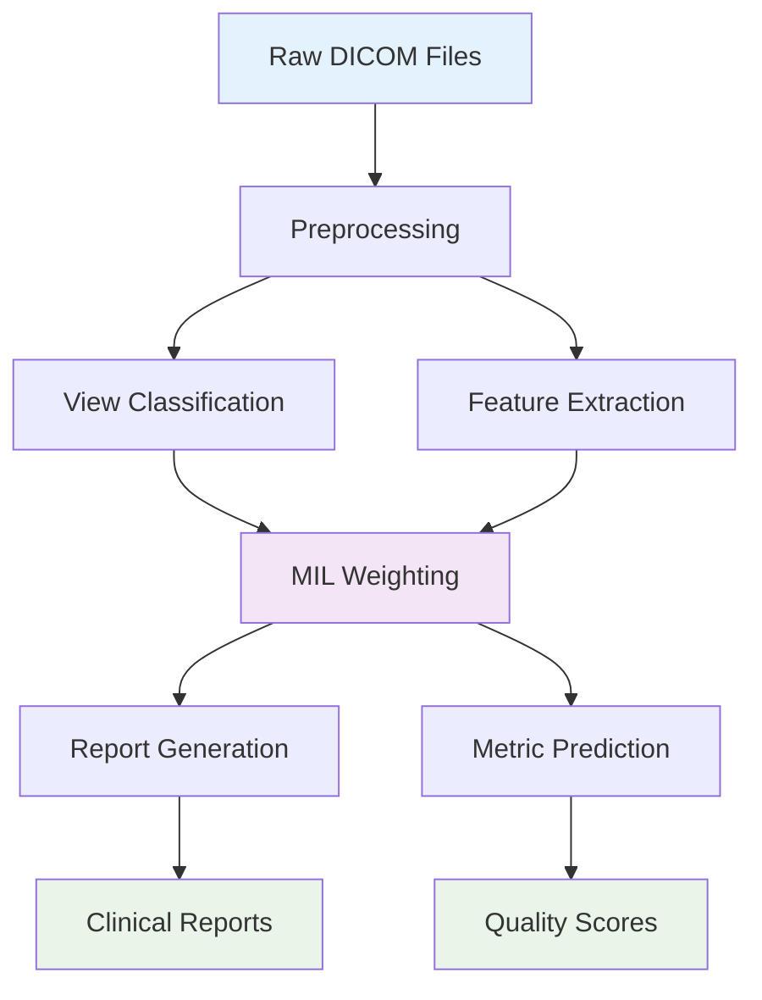

# 📁 EchoPrime Project Structure

This document explains the organization of the EchoPrime project and the purpose of each directory and file.

## 🏗️ Directory Overview

```
models.echoprime/
├── 📄 Project Configuration
│   ├── Dockerfile              # Docker container configuration
│   ├── Dockerfile.jupyter      # Jupyter-specific Docker setup
│   ├── Makefile               # Build and run commands
│   ├── pyproject.toml         # Poetry dependencies and project config
│   ├── requirements.txt       # Legacy pip requirements
│   └── README.md              # Main project documentation
│
├── 📊 Data Directories
│   ├── raw_data/              # Input DICOM files (user-provided)
│   ├── preprocessed_data/     # Processed video frames
│   ├── results/               # Analysis outputs and reports
│   └── training_data/         # Training datasets
│
├── 🧠 Core Modules
│   ├── inference/             # Main inference pipeline
│   │   ├── __init__.py
│   │   ├── inference.py       # Primary inference script
│   │   └── inference_per_patient.py  # Patient-specific processing
│   │
│   ├── preprocessors/         # Video preprocessing utilities
│   │   ├── __init__.py
│   │   ├── image_scaling.py   # Frame scaling and cropping
│   │   └── ultrasound_masking.py  # Ultrasound region masking
│   │
│   ├── tools/                 # Utility functions
│   │   ├── __init__.py
│   │   ├── dicom_analyzer.py  # DICOM file analysis
│   │   ├── dicom_organizer.py # DICOM file organization
│   │   ├── report_processing.py  # Report generation utilities
│   │   └── video_io.py        # Video I/O operations
│   │
│   └── training/              # Model training components
│       ├── __init__.py
│       ├── data_preparation.py    # Training data preparation
│       ├── echoprime_finetune.py  # Fine-tuning scripts
│       └── training_utils.py      # Training utilities
│
├── 🎯 Model Assets
│   └── weights/               # Pre-trained model weights
│       ├── echo_prime_encoder.pt     # Main video encoder (~138MB)
│       ├── view_classifier.ckpt      # View classification model (~350MB)
│       └── candidates_data/          # Knowledge base for RAG (~500MB)
│           ├── candidate_embeddings_p1.pt
│           ├── candidate_embeddings_p2.pt
│           ├── candidate_reports.pkl
│           └── candidate_labels.pkl
│
├── 📓 Interactive Notebooks
│   └── notebooks/
│       ├── EchoPrime-Demo.ipynb          # Main demonstration notebook
│       └── View-Classification-Demo.ipynb # View classification examples
│
├── 🛠️ Scripts
│   └── scripts/
│       ├── unpack_dicom_files.py         # DICOM extraction utilities
│       ├── unpack_echoprime_dicom.py     # EchoPrime-specific DICOM processing
│       └── visualize_results.py          # Result visualization
│
└── 📚 Documentation
    └── docs/
        ├── README.md                      # Documentation overview
        ├── GETTING_STARTED.md             # Setup and first run guide
        ├── ARCHITECTURE.md                # Technical system overview
        ├── COMMAND_REFERENCE.md           # Complete command reference
        ├── TRAINING.md                    # Model training guide
        ├── TROUBLESHOOTING.md             # Problem resolution guide
        ├── MODEL_WEIGHTS_EXPLAINED.md     # Model components explanation
        └── README_DICOM_UNPACKER.md       # DICOM processing guide
```

## 🔧 Key Components

### Preprocessing Pipeline
- **Image Scaling**: `preprocessors/image_scaling.py`
  - `crop_and_scale()` - Frame cropping and scaling
  - `apply_zoom()` - Zoom transformations
- **Ultrasound Masking**: `preprocessors/ultrasound_masking.py`
  - `mask_outside_ultrasound()` - Remove non-ultrasound regions
  - `downsample_and_crop()` - Efficient frame processing

### Video I/O Operations
- **Video Processing**: `tools/video_io.py`
  - `read_video()` - DICOM video reading
  - `write_video()` - Video output
  - `write_to_avi()` - AVI format conversion
  - `write_image()` - Image extraction
  - Color space conversion utilities

### Report Generation
- **Report Processing**: `tools/report_processing.py`
  - Clinical report generation
  - Structured text processing
  - Metric extraction and formatting

## 🚀 Quick Start Workflow

### 1. Setup
```bash
make init                # Install dependencies
make download-weights    # Download model weights
```

### 2. Organize Data
```bash
# Place DICOM files in study folders
raw_data/
├── patient_001_study_001/
│   ├── apical_4ch.dcm
│   ├── apical_2ch.dcm
│   └── parasternal_long.dcm
└── patient_002_study_001/
    ├── apical_4ch.dcm
    └── subcostal.dcm
```

### 3. Run Analysis
```bash
make inference           # Process all studies
```

### 4. View Results
```bash
# Results structure:
results/inference_output/
├── summary.json                    # Overall summary
├── patient_001_study_001/
│   ├── clinical_report.txt        # Generated report
│   ├── metrics_predictions.json   # Predicted metrics
│   ├── view_classifications.json  # Identified views
│   └── quality_scores.json       # Quality assessment
└── patient_002_study_001/
    └── ...
```

## 📊 Data Flow



## 🎯 Key Features

- **Multi-View Intelligence**: Automatically combines information from multiple echocardiographic views
- **Quality Assessment**: Built-in video quality evaluation
- **Comprehensive Reports**: Generates detailed clinical reports for 15 anatomical sections
- **Flexible Processing**: Supports single studies or batch processing
- **Docker Support**: Containerized deployment options
- **Interactive Analysis**: Jupyter notebooks for exploration

---

For detailed usage instructions, see the [Getting Started Guide](GETTING_STARTED.md).
