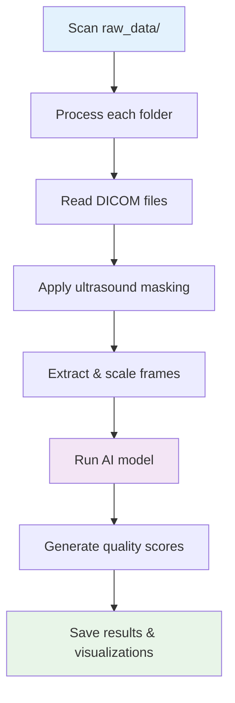

# 📖 Command Reference Guide

Complete reference for all EchoQuality commands, options, and usage patterns.

## 🎯 Quick Command Overview

| Command | Purpose | Time to Complete |
|---------|---------|------------------|
| `make init` | Setup environment | 2-5 minutes |
| `make download-weights` | Download model files | 3-10 minutes |
| `make inference` | Run quality assessment | 1-30 minutes |
| `make visualize` | Generate charts | 30 seconds |
| `make jupyter` | Launch notebook | 10 seconds |
| `make train` | Train custom model | 1-8 hours |
| `make clean` | Clean up files | 10 seconds |

## 🛠️ Setup Commands

### `make init`
**Purpose**: Initialize the Poetry environment and create necessary directories.

```bash
make init
```

**What it does**:
- Installs all Python dependencies via Poetry
- Creates directories: `raw_data/`, `preprocessed_data/`, `results/`, `weights/`, `training_data/`
- Sets up the development environment

**Output**:
```
Setting up Poetry environment...
Poetry environment setup complete!
```

**Troubleshooting**:
- If Poetry is not installed: `curl -sSL https://install.python-poetry.org | python3 -`
- If permission errors: Check directory write permissions

---

### `make download-weights`
**Purpose**: Download pre-trained model weights and embeddings.

```bash
make download-weights
```

**Downloads**:
- `video_quality_model.pt` (150MB) - Main quality assessment model
- `echo_prime_encoder.pt` (100MB) - Feature extraction model  
- `view_classifier.ckpt` (50MB) - View classification model
- `candidates_data.zip` (200MB) - Reference embeddings

**Total Size**: ~500MB

**Output**:
```
Downloading model weights and embeddings...
Downloading video_quality_model.pt...
Downloading echo_prime_encoder.pt...
...
Model weights and embeddings download complete!
```

**Troubleshooting**:
- If download fails: Check internet connection and retry
- If files exist: Command skips existing files automatically
- If corrupted: Delete files in `weights/` and re-run

## 🔍 Inference Commands

### `make inference`
**Purpose**: Run quality assessment on all DICOM files in `raw_data/`.

```bash
make inference
```

**Equivalent to**:
```bash
poetry run python -m inference.inference --data_dir ./raw_data --output ./results/inference_output
```

**Processing Flow**:


**Output Directories**:
- `preprocessed_data/` - Extracted images
- `results/inference_output/` - Analysis results

---

### Advanced Inference Options

#### Custom Data Directory
```bash
poetry run python -m inference.inference --data_dir /path/to/custom/data
```

#### Custom Quality Threshold
```bash
# Default threshold is 0.3 (30%)
poetry run python -m inference.inference --threshold 0.5
```

#### Enable GradCAM Visualizations
```bash
poetry run python -m inference.inference --gradcam
```

#### Force CPU/GPU Processing
```bash
# Force CPU (if GPU issues)
poetry run python -m inference.inference --device cpu

# Force GPU
poetry run python -m inference.inference --device cuda

# Auto-detect (default)
poetry run python -m inference.inference --device auto
```

#### Custom Output Directory
```bash
poetry run python -m inference.inference --output ./custom_results
```

#### Complete Custom Command
```bash
poetry run python -m inference.inference \
    --data_dir ./my_data \
    --output ./my_results \
    --threshold 0.4 \
    --gradcam \
    --device cuda
```

## 📊 Visualization Commands

### `make visualize`
**Purpose**: Generate comprehensive result visualizations.

```bash
make visualize
```

**Equivalent to**:
```bash
poetry run python scripts/visualize_results.py --results_dir ./results/inference_output --output_dir ./results/visualization_output
```

**Generated Visualizations**:
- Cross-device quality comparisons
- Score distribution histograms
- Pass/fail rate charts
- Error pattern analysis
- Device performance summaries

**Output**: `results/visualization_output/`

---

### Custom Visualization Options

#### Custom Input Directory
```bash
poetry run python scripts/visualize_results.py --results_dir ./custom_results
```

#### Custom Output Directory
```bash
poetry run python scripts/visualize_results.py --output_dir ./custom_viz
```

## 🎓 Training Commands

### `make training-data`
**Purpose**: Prepare training datasets from inference results.

```bash
make training-data
```

**Equivalent to**:
```bash
poetry run python scripts/prepare_training_data.py
```

**What it does**:
- Analyzes inference results
- Selects high-quality examples (score > 0.95)
- Selects low-quality examples (score < 0.1)
- Organizes data for training

**Output**: `training_data/` directory with organized datasets

---

### `make train`
**Purpose**: Train the quality model on your custom data.

```bash
make train
```

**Equivalent to**:
```bash
poetry run python -m training.train_quality_model
```

**Training Process**:


**Requirements**:
- Training data in `training_data/`
- At least 50 annotated examples
- GPU recommended for faster training

## 🔧 Utility Commands

### `make jupyter`
**Purpose**: Launch Jupyter notebook for interactive analysis.

```bash
make jupyter
```

**Equivalent to**:
```bash
poetry run python scripts/run_jupyter.py --port 8888
```

**Access**: Open `http://localhost:8888` in your browser

**Available Notebooks**:
- `EchoPrime-Video-Quality-Demo.ipynb` - Quality assessment demo
- `EchoQuality-Interactive-Analysis.ipynb` - Result analysis

---

### `make clean`
**Purpose**: Clean up temporary files and reset directories.

```bash
make clean
```

**What it removes**:
- Python cache files (`__pycache__/`, `*.pyc`)
- Temporary files (`.DS_Store`, etc.)
- Result directories (`results/`, `preprocessed_data/`)
- Jupyter checkpoints

**Use when**:
- Starting fresh analysis
- Cleaning up disk space
- Resolving file conflicts

## 🐳 Docker Commands

### `make build-docker`
**Purpose**: Build Docker image for EchoQuality.

```bash
make build-docker
```

**Creates**: `echoquality` Docker image

---

### `make build-jupyter`
**Purpose**: Build Docker image with Jupyter support.

```bash
make build-jupyter
```

**Creates**: `echoquality-jupyter` Docker image

---

### `make run-docker`
**Purpose**: Run EchoQuality in Docker container.

```bash
make run-docker
```

**Access**: `http://localhost:8888`

---

### `make run-jupyter`
**Purpose**: Run Jupyter in Docker container.

```bash
make run-jupyter
```

**Features**:
- Interactive container
- Volume mounting for data access
- Automatic cleanup on exit

## 🔧 Debug Commands

### Basic Debug Tool
```bash
python -m scripts.debug_scaling /path/to/dicom/file.dcm
```

**Purpose**: Basic debugging with detailed logging and visualization.

**Output**: `results/debug_images/` and `debug_scaling.log`

---

### Interactive Debug Tool
```bash
python -m scripts.debug_scaling_interactive /path/to/dicom/file.dcm
```

**Purpose**: Step-by-step interactive debugging with breakpoints.

**Features**:
- Python debugger (pdb) integration
- Frame-by-frame analysis
- Real-time image display

---

### Visual Debug Tool
```bash
python -m scripts.debug_scaling_visual /path/to/dicom/file.dcm
```

**Purpose**: Comprehensive visual debugging with comparisons.

**Features**:
- Side-by-side image comparisons
- Detailed image statistics
- Histogram analysis

---

### Specialized Debug Tool
```bash
python -m scripts.debug_scaling_specialized /path/to/dicom/file.dcm
```

**Purpose**: Debug unusual image dimensions and aspect ratios.

**Features**:
- Alternative scaling algorithms
- Extreme aspect ratio handling
- Padding-to-square approach

## 📋 Command Combinations

### Complete Workflow
```bash
# Setup and first run
make init
make download-weights
make inference
make visualize

# View results
make jupyter
```

### Custom Analysis
```bash
# Custom threshold and GradCAM
poetry run python -m inference.inference --threshold 0.4 --gradcam

# Generate visualizations
make visualize

# Debug problematic files
python -m scripts.debug_scaling_visual ./raw_data/device_A/problem_file.dcm
```

### Training Workflow
```bash
# Prepare training data from results
make training-data

# Train custom model
make train

# Test new model
poetry run python -m inference.inference --model ./trained_models/best_model.pt
```

## ⚙️ Configuration Options

### Environment Variables
```bash
# Set custom Jupyter port
export JUPYTER_PORT=9999
make jupyter

# Set custom Poetry environment
export POETRY_VENV_IN_PROJECT=1
make init
```

### Model Parameters
Edit `training/train_quality_model.py`:
```python
BATCH_SIZE = 8          # Reduce if GPU memory issues
EPOCHS = 20             # Increase for better training
LEARNING_RATE = 1e-4    # Adjust learning speed
THRESHOLD = 0.3         # Quality threshold
```

### Inference Parameters
Edit `inference/inference.py`:
```python
frames_to_take = 32     # Number of frames to analyze
frame_stride = 2        # Frame sampling rate
video_size = 112        # Input image size
```

## 🚨 Error Handling

### Common Exit Codes
- `0` - Success
- `1` - General error
- `2` - File not found
- `130` - Interrupted by user (Ctrl+C)

### Error Categories
1. **Setup Errors**: Poetry, dependencies, weights
2. **Data Errors**: DICOM format, file permissions
3. **Processing Errors**: GPU memory, model loading
4. **Output Errors**: Disk space, write permissions

### Recovery Commands
```bash
# Reset environment
make clean
make init

# Re-download corrupted weights
rm -rf weights/
make download-weights

# Clear GPU memory
poetry run python -c "import torch; torch.cuda.empty_cache()"
```

## 📊 Performance Monitoring

### Resource Usage
```bash
# Monitor GPU usage
nvidia-smi

# Monitor CPU and memory
htop

# Monitor disk space
df -h
```

### Benchmarking
```bash
# Time inference
time make inference

# Profile memory usage
poetry run python -m memory_profiler inference/inference.py
```

---

## 🔗 Related Documentation

- **[Getting Started Guide](GETTING_STARTED.md)** - First-time setup
- **[Pipeline Documentation](PIPELINE.md)** - Technical details
- **[Debug Tools Guide](DEBUG_TOOLS.md)** - Troubleshooting
- **[Training Guide](TRAINING.md)** - Model customization

---

**Need help?** Check the [Troubleshooting Guide](TROUBLESHOOTING.md) or use the debug tools for specific issues.
