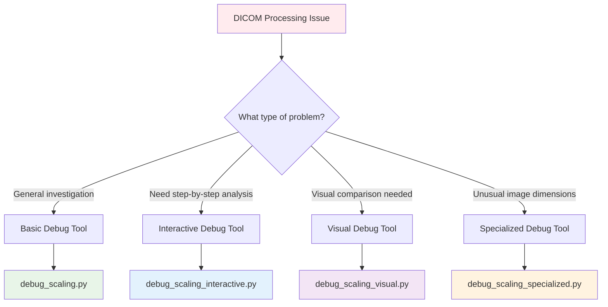
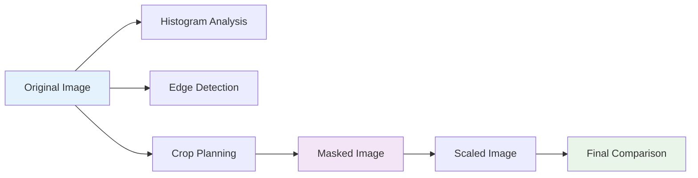
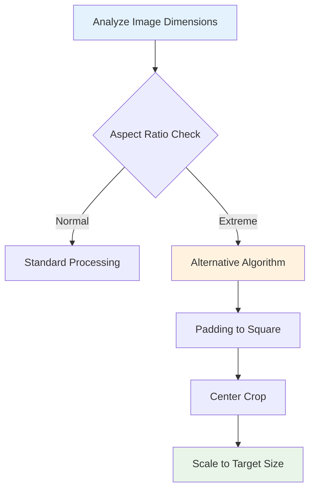
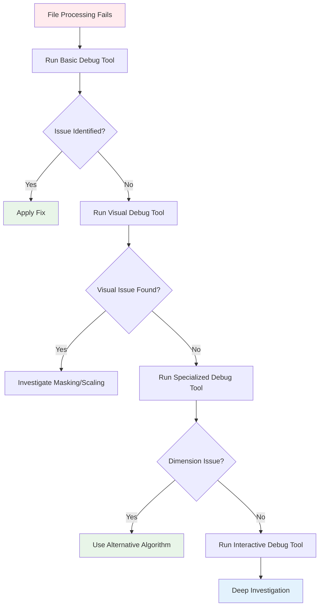

# 🔧 Debug Tools Guide

Comprehensive guide to EchoQuality's debugging and troubleshooting tools for investigating DICOM processing issues.

## 🎯 When to Use Debug Tools

Debug tools help you investigate and resolve issues with specific DICOM files that fail processing or produce unexpected results.

### Common Scenarios
- **Files failing quality assessment**: DICOM files that can't be processed
- **Unexpected quality scores**: Files getting scores that don't match visual assessment
- **Processing errors**: Files causing crashes or errors in the pipeline
- **Image scaling issues**: Problems with very narrow, wide, or unusual aspect ratios
- **Masking problems**: Ultrasound region detection failures

## 🛠️ Available Debug Tools

### Tool Selection Guide



## 🔍 Tool 1: Basic Debug Tool

### `debug_scaling.py`
**Best for**: General debugging with detailed logging and visualization.

#### Usage
```bash
# Interactive mode (prompts for file path)
python -m scripts.debug_scaling

# Command line mode
python -m scripts.debug_scaling /path/to/dicom/file.dcm

# From Python code
from scripts import debug_scaling
debug_scaling.main("/path/to/dicom/file.dcm")
```

#### What It Does
- Provides detailed logging of each step in the crop_and_scale process
- Saves debug images showing transformation at each stage
- Processes up to 5 frames for analysis
- Creates comprehensive log files

#### Output Structure
```
results/debug_images/
├── frame_0_original.png          # Original DICOM frame
├── frame_0_masked.png            # After ultrasound masking
├── frame_0_scaled.png            # After scaling/cropping
├── frame_1_original.png
├── ...
└── processing_summary.txt        # Summary of all steps

debug_scaling.log                 # Detailed processing log
```

#### Sample Log Output
```
[INFO] Processing DICOM file: /path/to/study.dcm
[INFO] Original dimensions: (480, 640, 120, 3)
[INFO] After masking: (480, 640, 120, 3)
[INFO] Frame 0 - Original size: (480, 640)
[INFO] Frame 0 - After crop_and_scale: (112, 112)
[INFO] Processing completed successfully
```

#### When to Use
- First-time investigation of problematic files
- Quick overview of processing pipeline
- Identifying which step is causing issues

---

## 🎮 Tool 2: Interactive Debug Tool

### `debug_scaling_interactive.py`
**Best for**: Step-by-step debugging with manual control and breakpoints.

#### Usage
```bash
# Interactive mode (prompts for file path)
python -m scripts.debug_scaling_interactive

# Command line mode
python -m scripts.debug_scaling_interactive /path/to/dicom/file.dcm
```

#### Interactive Features
- **Python debugger (pdb) integration**: Set breakpoints and inspect variables
- **Frame selection**: Choose which frames to analyze in detail
- **Real-time image display**: View images at each processing step
- **Variable inspection**: Examine array shapes, values, and statistics

#### Interactive Session Example
```python
# At breakpoint
(Pdb) p pixels.shape
(480, 640, 120, 3)

(Pdb) p np.min(pixels), np.max(pixels)
(0, 255)

(Pdb) # Continue to next step
(Pdb) c

# View current frame
(Pdb) plt.imshow(current_frame)
(Pdb) plt.show()
```

#### Debug Commands
- `n` - Next line
- `c` - Continue execution
- `p variable_name` - Print variable value
- `pp variable_name` - Pretty print variable
- `l` - List current code
- `h` - Help

#### Output Structure
```
results/debug_images_interactive/
├── session_log.txt               # Interactive session log
├── frame_0/
│   ├── step_1_original.png
│   ├── step_2_masked.png
│   └── step_3_scaled.png
└── frame_1/
    └── ...

debug_scaling_interactive.log     # Detailed processing log
```

#### When to Use
- Deep investigation of specific processing steps
- Experimenting with different parameters
- Understanding exactly what happens at each stage
- Debugging complex scaling or masking issues

---

## 🎨 Tool 3: Visual Debug Tool

### `debug_scaling_visual.py`
**Best for**: Comprehensive visual analysis with side-by-side comparisons.

#### Usage
```bash
# Interactive mode (prompts for file path)
python -m scripts.debug_scaling_visual

# Command line mode
python -m scripts.debug_scaling_visual /path/to/dicom/file.dcm
```

#### Visual Features
- **Side-by-side comparisons**: Before/after images at each step
- **Image statistics**: Histograms, mean, std, min/max values
- **Crop planning visualization**: Shows exactly where cropping will occur
- **Edge detection analysis**: Helps understand masking decisions
- **Frame-specific directories**: Organized output for each frame

#### Generated Visualizations



#### Output Structure
```
results/debug_images_visual/
├── frame_0/
│   ├── 01_original_details.png      # Original with statistics
│   ├── 02_histogram_analysis.png    # Pixel value distribution
│   ├── 03_edge_detection.png        # Edge analysis
│   ├── 04_crop_planning.png         # Crop region overlay
│   ├── 05_masked_comparison.png     # Before/after masking
│   ├── 06_scaling_comparison.png    # Before/after scaling
│   └── 07_final_summary.png         # Complete pipeline summary
├── frame_1/
│   └── ...
└── overall_summary.png              # Multi-frame comparison

debug_scaling_visual.log             # Detailed processing log
```

#### Sample Visualizations
- **Original Details**: Shows image with dimensions, pixel ranges, and basic statistics
- **Histogram Analysis**: Pixel value distributions to identify issues
- **Crop Planning**: Overlays showing exactly where the image will be cropped
- **Masked Comparison**: Side-by-side before/after ultrasound masking
- **Scaling Comparison**: Before/after scaling to 112x112 pixels

#### When to Use
- Investigating visual quality issues
- Understanding why certain regions are masked
- Analyzing the effect of scaling on image quality
- Comparing processing results across multiple frames

---

## 🎯 Tool 4: Specialized Debug Tool

### `debug_scaling_specialized.py`
**Best for**: Debugging unusual image dimensions and extreme aspect ratios.

#### Usage
```bash
# Interactive mode (prompts for file path)
python -m scripts.debug_scaling_specialized

# Command line mode
python -m scripts.debug_scaling_specialized /path/to/dicom/file.dcm
```

#### Specialized Features
- **Alternative scaling algorithms**: For extreme aspect ratios
- **Padding-to-square approach**: Handles very narrow or wide images
- **Detailed dimension analysis**: Explains why standard scaling fails
- **Pixel-level visualization**: For very small images
- **Recommendations**: Suggests fixes for unusual dimensions

#### Problem Detection


#### Handled Cases
- **Very narrow images**: Width << Height (e.g., 50x800)
- **Very wide images**: Width >> Height (e.g., 800x50)
- **Tiny images**: Both dimensions very small (e.g., 20x30)
- **Huge images**: Both dimensions very large (e.g., 2000x3000)
- **Non-square ratios**: Unusual aspect ratios that cause distortion

#### Output Structure
```
results/debug_images_specialized/
├── dimension_analysis.png           # Aspect ratio analysis
├── standard_vs_alternative.png      # Algorithm comparison
├── padding_demonstration.png        # Padding approach
├── final_recommendation.png         # Suggested solution
└── processing_report.txt            # Detailed analysis report

debug_scaling_specialized.log        # Specialized processing log
```

#### Sample Analysis Report
```
SPECIALIZED DIMENSION ANALYSIS
==============================
Original dimensions: 45 x 680 (aspect ratio: 0.066)
Problem: Extremely narrow image (width << height)

Standard algorithm result: Severe distortion
Alternative algorithm: Padding to square + center crop
Recommendation: Use padding approach for this image type

Processing steps:
1. Pad to square: 680 x 680
2. Center original: (317, 0) to (362, 680)
3. Scale to target: 112 x 112
4. Result: Minimal distortion, preserved aspect ratio
```

#### When to Use
- Files with unusual dimensions causing processing failures
- Images that look severely distorted after processing
- Very narrow or wide ultrasound images
- Investigating scaling algorithm alternatives

---

## 🚀 Quick Debug Workflow

### Step-by-Step Debugging Process



### 1. Quick Investigation
```bash
# Start with basic debugging
python -m scripts.debug_scaling /path/to/problem_file.dcm

# Check the log file
cat debug_scaling.log
```

### 2. Visual Analysis
```bash
# If basic debugging doesn't reveal the issue
python -m scripts.debug_scaling_visual /path/to/problem_file.dcm

# Review the generated visualizations
ls results/debug_images_visual/frame_0/
```

### 3. Dimension Issues
```bash
# If the file has unusual dimensions
python -m scripts.debug_scaling_specialized /path/to/problem_file.dcm

# Check the recommendations
cat results/debug_images_specialized/processing_report.txt
```

### 4. Deep Investigation
```bash
# For complex issues requiring step-by-step analysis
python -m scripts.debug_scaling_interactive /path/to/problem_file.dcm

# Use pdb commands to investigate
# Set breakpoints, inspect variables, test fixes
```

## 🔧 Common Issues and Solutions

### Issue 1: "Empty pixel array"
**Symptoms**: File fails with empty or missing pixel data
**Debug Tool**: Basic Debug Tool
**Solution**: 
```bash
python -m scripts.debug_scaling /path/to/file.dcm
# Check if DICOM file is corrupted or has no pixel data
```

### Issue 2: "Severe image distortion"
**Symptoms**: Processed images look stretched or compressed
**Debug Tool**: Specialized Debug Tool
**Solution**:
```bash
python -m scripts.debug_scaling_specialized /path/to/file.dcm
# Use alternative scaling algorithm for extreme aspect ratios
```

### Issue 3: "Masking removes too much"
**Symptoms**: Important ultrasound regions are masked out
**Debug Tool**: Visual Debug Tool
**Solution**:
```bash
python -m scripts.debug_scaling_visual /path/to/file.dcm
# Review masking steps and adjust parameters
```

### Issue 4: "Processing crashes unexpectedly"
**Symptoms**: Python errors during processing
**Debug Tool**: Interactive Debug Tool
**Solution**:
```bash
python -m scripts.debug_scaling_interactive /path/to/file.dcm
# Step through code to find exact failure point
```

## 📊 Debug Output Analysis

### Log File Interpretation
```bash
# Check for common error patterns
grep -i "error\|fail\|exception" debug_scaling.log

# Look for dimension issues
grep -i "dimension\|shape\|size" debug_scaling.log

# Find processing statistics
grep -i "min\|max\|mean\|std" debug_scaling.log
```

### Image Analysis Checklist
1. **Original Image**: Does it look like a valid ultrasound?
2. **Masked Image**: Is the ultrasound region preserved?
3. **Scaled Image**: Is the aspect ratio reasonable?
4. **Final Result**: Does it match the original quality?

### Performance Metrics
- **Processing Time**: Should be < 5 seconds per file
- **Memory Usage**: Should be < 2GB for typical files
- **Output Quality**: Visual similarity to original

## 🔗 Integration with Main Pipeline

### Using Debug Results
```bash
# After debugging, test the fix in the main pipeline
poetry run python -m inference.inference --data_dir ./test_data

# Compare results before and after fixes
diff old_results.json new_results.json
```

### Batch Debugging
```bash
# Debug multiple problematic files
for file in raw_data/device_A/*.dcm; do
    python -m scripts.debug_scaling_visual "$file"
done
```

### Automated Issue Detection
```python
# Custom script to identify files needing debugging
import json

with open('results/inference_output/summary.json') as f:
    results = json.load(f)

# Find files with processing errors
failed_files = []
for folder_result in results['folder_results']:
    if folder_result['status'] == 'failed':
        failed_files.append(folder_result['folder'])

print(f"Files needing debugging: {failed_files}")
```

## 📚 Advanced Debugging Techniques

### Custom Debug Scripts
```python
# Create custom debugging for specific issues
import pydicom
import numpy as np
from scripts.debug_scaling import analyze_dimensions

def custom_debug(dicom_path):
    dcm = pydicom.dcmread(dicom_path)
    pixels = dcm.pixel_array
    
    # Custom analysis
    print(f"Unique values: {len(np.unique(pixels))}")
    print(f"Data type: {pixels.dtype}")
    print(f"Memory usage: {pixels.nbytes / 1024 / 1024:.2f} MB")
    
    return analyze_dimensions(pixels)
```

### Performance Profiling
```bash
# Profile memory usage during debugging
python -m memory_profiler scripts/debug_scaling.py /path/to/file.dcm

# Profile execution time
python -m cProfile -o debug_profile.prof scripts/debug_scaling.py /path/to/file.dcm
```

### Comparative Analysis
```bash
# Compare debug results across different files
python -m scripts.debug_scaling_visual file1.dcm
python -m scripts.debug_scaling_visual file2.dcm

# Use diff to compare logs
diff debug_scaling_visual_file1.log debug_scaling_visual_file2.log
```

---

## 🔗 Related Documentation

- **[Getting Started Guide](GETTING_STARTED.md)** - Basic setup and usage
- **[Pipeline Documentation](PIPELINE.md)** - Technical pipeline details
- **[Command Reference](COMMAND_REFERENCE.md)** - All available commands
- **[Troubleshooting Guide](TROUBLESHOOTING.md)** - Common issues and solutions

---

**Need more help?** The debug tools provide detailed logs and visualizations to help identify and resolve processing issues. Start with the basic debug tool and progress to more specialized tools as needed.
