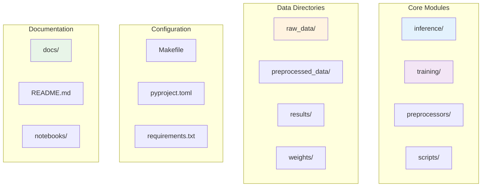
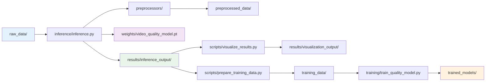
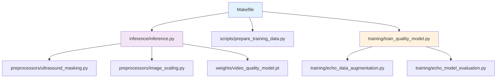

# 📁 File Structure Guide

Comprehensive guide to understanding the EchoQuality project organization, file purposes, and data flow.

## 🏗️ Project Overview

EchoQuality is organized into logical modules that separate concerns and make the codebase maintainable and extensible.



## 📂 Directory Structure

### Root Directory
```
models.echoquality/
├── 📁 docs/                          # Documentation files
├── 📁 inference/                     # Inference and quality assessment
├── 📁 training/                      # Model training and evaluation
├── 📁 preprocessors/                 # Image preprocessing utilities
├── 📁 scripts/                       # Utility and debug scripts
├── 📁 notebooks/                     # Jupyter notebooks for analysis
├── 📁 raw_data/                      # Input DICOM files (user-provided)
├── 📁 preprocessed_data/             # Processed images (generated)
├── 📁 results/                       # Analysis results (generated)
├── 📁 weights/                       # Model weights and embeddings
├── 📁 training_data/                 # Training datasets (generated)
├── 📁 trained_models/                # Custom trained models (generated)
├── 📄 Makefile                       # Build and automation commands
├── 📄 pyproject.toml                 # Poetry configuration
├── 📄 requirements.txt               # Python dependencies
├── 📄 README.md                      # Project overview
├── 📄 LICENSE                        # License information
├── 📄 Dockerfile                     # Docker configuration
└── 📄 Dockerfile.jupyter             # Jupyter Docker configuration
```

## 🔍 Core Modules

### 📁 `inference/` - Quality Assessment Engine

The heart of the quality assessment system.

```
inference/
├── __init__.py                       # Module initialization
└── inference.py                      # Main inference pipeline
```

#### `inference.py`
**Purpose**: Main quality assessment pipeline
**Key Classes**:
- `EchoQualityInference`: Core inference engine
**Key Functions**:
- `run_inference_on_folder()`: Process DICOM files in a folder
- `process_dicom()`: Process individual DICOM files
- `create_summary_plot()`: Generate result visualizations

**Usage**:
```python
from inference.inference import EchoQualityInference

# Initialize inference engine
inference = EchoQualityInference(model_path="weights/video_quality_model.pt")

# Process a folder of DICOM files
results = inference.run_inference_on_folder("raw_data/device_A/")
```

---

### 📁 `training/` - Model Training and Evaluation

Contains all training-related functionality.

```
training/
├── __init__.py                       # Module initialization
├── train_quality_model.py           # Main training script
├── echo_data_augmentation.py        # Data augmentation utilities
├── echo_model_evaluation.py         # Model evaluation and visualization
└── example_training.py              # Training examples and demos
```

#### `train_quality_model.py`
**Purpose**: Main training script with MLflow integration
**Key Functions**:
- `freeze_model_except_final_layers()`: Transfer learning setup
- `train_epoch()`: Single epoch training
- `validate_epoch()`: Model validation

#### `echo_data_augmentation.py`
**Purpose**: Advanced data augmentation for echo videos
**Key Classes**:
- `EchoVideoAugmentation`: Video-specific augmentation
**Key Functions**:
- `create_synthetic_low_quality()`: Generate synthetic poor-quality data

#### `echo_model_evaluation.py`
**Purpose**: Comprehensive model evaluation
**Key Functions**:
- `evaluate_model()`: Calculate performance metrics
- `visualize_gradcam()`: Generate attention visualizations
- `analyze_misclassifications()`: Error analysis

---

### 📁 `preprocessors/` - Image Processing

Core image preprocessing functionality.

```
preprocessors/
├── __init__.py                       # Module initialization
├── image_scaling.py                  # Image scaling and cropping
└── ultrasound_masking.py            # Ultrasound region masking
```

#### `ultrasound_masking.py`
**Purpose**: Remove non-ultrasound regions from images
**Key Functions**:
- `mask_outside_ultrasound()`: Main masking function
- `find_ultrasound_region()`: Detect ultrasound boundaries

#### `image_scaling.py`
**Purpose**: Standardize image dimensions
**Key Functions**:
- `crop_and_scale()`: Resize images to model input size
- `maintain_aspect_ratio()`: Preserve image proportions

---

### 📁 `scripts/` - Utilities and Debug Tools

Helper scripts for various tasks.

```
scripts/
├── debug_scaling.py                  # Basic debug tool
├── debug_scaling_interactive.py     # Interactive debugging
├── debug_scaling_visual.py          # Visual debugging
├── debug_scaling_specialized.py     # Specialized dimension debugging
├── prepare_training_data.py         # Training data preparation
├── visualize_results.py             # Result visualization
└── run_jupyter.py                   # Jupyter notebook launcher
```

#### Debug Tools
- **`debug_scaling.py`**: Basic debugging with logging
- **`debug_scaling_interactive.py`**: Step-by-step debugging with pdb
- **`debug_scaling_visual.py`**: Visual comparison debugging
- **`debug_scaling_specialized.py`**: Handle unusual image dimensions

#### Utility Scripts
- **`prepare_training_data.py`**: Organize data for training
- **`visualize_results.py`**: Generate comprehensive visualizations
- **`run_jupyter.py`**: Launch Jupyter with proper configuration

---

### 📁 `notebooks/` - Interactive Analysis

Jupyter notebooks for exploration and analysis.

```
notebooks/
├── EchoPrime-Video-Quality-Demo.ipynb      # Quality assessment demo
└── EchoQuality-Interactive-Analysis.ipynb  # Result analysis notebook
```

#### Notebook Purposes
- **Demo Notebook**: Interactive quality assessment demonstration
- **Analysis Notebook**: Explore results, generate custom visualizations

## 📊 Data Directories

### 📁 `raw_data/` - Input Data

**Purpose**: Store input DICOM files organized by study
**Structure**:
```
raw_data/
├── patient_001_device_A_study_001/
│   ├── view1.dcm
│   ├── view2.dcm
│   └── view3.dcm
├── patient_002_device_B_study_001/
│   ├── apical_4ch.dcm
│   └── parasternal_long.dcm
└── patient_003_device_A_study_002/
    └── ...
```

**Organization Rules**:
- One folder per patient/device/study combination
- Only DICOM files (.dcm) in each folder
- Descriptive folder names for easy identification

---

### 📁 `preprocessed_data/` - Processed Images

**Purpose**: Store extracted and processed images from DICOM files
**Generated by**: Inference pipeline
**Structure**:
```
preprocessed_data/
├── device_A/
│   ├── 1_raw_extracted/              # Raw extracted frames
│   ├── 2_masked/                     # After ultrasound masking
│   └── 3_scaled_cropped/             # Final processed frames
├── device_B/
│   └── ...
└── device_C/
    └── ...
```

**Content**: PNG images showing processing stages

---

### 📁 `results/` - Analysis Results

**Purpose**: Store quality assessment results and visualizations
**Generated by**: Inference and visualization pipelines
**Structure**:
```
results/
├── inference_output/                 # Main inference results
│   ├── summary.json                  # Overall summary
│   ├── device_A/
│   │   ├── folder_summary.json       # Device summary
│   │   ├── inference_results.json    # Detailed results
│   │   ├── score_distribution.png    # Score histogram
│   │   ├── pass_fail_distribution.png # Pass/fail chart
│   │   ├── mask_images/              # Debug images
│   │   ├── gradcam/                  # Attention visualizations
│   │   └── device_A_failed_files.json # Error log
│   └── device_B/
│       └── ...
├── visualization_output/             # Enhanced visualizations
│   ├── cross_device_comparison.png
│   ├── quality_trends.png
│   └── error_analysis.png
└── debug_images/                     # Debug tool outputs
    ├── debug_images/
    ├── debug_images_interactive/
    ├── debug_images_visual/
    └── debug_images_specialized/
```

---

### 📁 `weights/` - Model Files

**Purpose**: Store pre-trained models and embeddings
**Downloaded by**: `make download-weights`
**Structure**:
```
weights/
├── video_quality_model.pt            # Main quality assessment model
├── echo_prime_encoder.pt             # Feature extraction model
├── view_classifier.ckpt              # View classification model
└── candidates_data/                  # Reference embeddings
    ├── candidate_embeddings_p1.pt
    └── candidate_embeddings_p2.pt
```

---

### 📁 `training_data/` - Training Datasets

**Purpose**: Organized datasets for model training
**Generated by**: `make training-data`
**Structure**:
```
training_data/
├── high_quality/                     # High-quality examples (score > 0.95)
├── low_quality/                      # Low-quality examples (score < 0.1)
├── train/                            # Training split
├── val/                              # Validation split
├── test/                             # Test split
└── annotations.csv                   # Quality labels
```

---

### 📁 `trained_models/` - Custom Models

**Purpose**: Store custom trained models
**Generated by**: `make train`
**Structure**:
```
trained_models/
├── best_model.pt                     # Best performing model
├── latest_model.pt                   # Most recent model
├── training_log.txt                  # Training history
└── model_metrics.json               # Performance metrics
```

## ⚙️ Configuration Files

### `Makefile`
**Purpose**: Automation and build commands
**Key Targets**:
- `init`: Setup environment
- `download-weights`: Download model files
- `inference`: Run quality assessment
- `train`: Train custom model
- `clean`: Clean up files

### `pyproject.toml`
**Purpose**: Poetry configuration and dependencies
**Sections**:
- `[tool.poetry]`: Project metadata
- `[tool.poetry.dependencies]`: Runtime dependencies
- `[tool.poetry.dev-dependencies]`: Development dependencies

### `requirements.txt`
**Purpose**: Pip-compatible dependency list
**Usage**: Fallback for environments without Poetry

## 📚 Documentation Structure

### 📁 `docs/` - Documentation Files

```
docs/
├── README.md                         # Documentation overview
├── GETTING_STARTED.md               # Setup and first run
├── PIPELINE.md                      # Technical pipeline details
├── COMMAND_REFERENCE.md             # All available commands
├── DEBUG_TOOLS.md                   # Debugging guide
├── TRAINING.md                      # Model training guide
├── QUALITY_SCORING.md               # Quality scoring system
├── TROUBLESHOOTING.md               # Common issues and solutions
└── FILE_STRUCTURE.md                # This file
```

## 🔄 Data Flow

### Processing Pipeline Flow



### File Dependencies



## 🔧 Customization Points

### Adding New Preprocessors
1. Create new file in `preprocessors/`
2. Implement processing function
3. Import in `inference/inference.py`
4. Add to processing pipeline

### Adding New Debug Tools
1. Create new file in `scripts/`
2. Follow existing debug tool patterns
3. Add documentation to `DEBUG_TOOLS.md`
4. Update `COMMAND_REFERENCE.md`

### Adding New Training Features
1. Extend `training/train_quality_model.py`
2. Add new augmentation to `echo_data_augmentation.py`
3. Add evaluation metrics to `echo_model_evaluation.py`
4. Update `TRAINING.md` documentation

## 📋 File Naming Conventions

### Python Files
- **Modules**: `snake_case.py`
- **Classes**: `PascalCase`
- **Functions**: `snake_case()`
- **Constants**: `UPPER_CASE`

### Data Files
- **DICOM files**: `*.dcm`
- **Images**: `*_frame_XX.png`
- **Results**: `*_results.json`
- **Summaries**: `*_summary.json`

### Directory Names
- **Code modules**: `lowercase`
- **Data directories**: `snake_case`
- **Generated content**: `snake_case`

## 🔍 Finding Specific Functionality

### Quality Assessment
- **Main pipeline**: `inference/inference.py`
- **Preprocessing**: `preprocessors/`
- **Model loading**: `inference/inference.py:_load_model()`

### Training
- **Main training**: `training/train_quality_model.py`
- **Data augmentation**: `training/echo_data_augmentation.py`
- **Evaluation**: `training/echo_model_evaluation.py`

### Debugging
- **Debug tools**: `scripts/debug_*.py`
- **Error handling**: `inference/inference.py:run_inference_on_folder()`
- **Logging**: Throughout codebase

### Visualization
- **Result plots**: `scripts/visualize_results.py`
- **Summary charts**: `inference/inference.py:create_summary_plot()`
- **Debug images**: `scripts/debug_*.py`

---

## 🔗 Related Documentation

- **[Getting Started Guide](GETTING_STARTED.md)** - Basic setup and usage
- **[Pipeline Documentation](PIPELINE.md)** - Technical pipeline details
- **[Command Reference](COMMAND_REFERENCE.md)** - All available commands
- **[Debug Tools Guide](DEBUG_TOOLS.md)** - Debugging utilities

---

**Understanding the file structure helps you navigate the codebase effectively** and know where to look for specific functionality or where to add new features.
