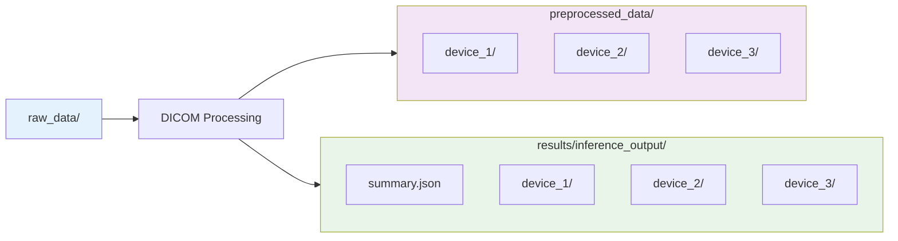
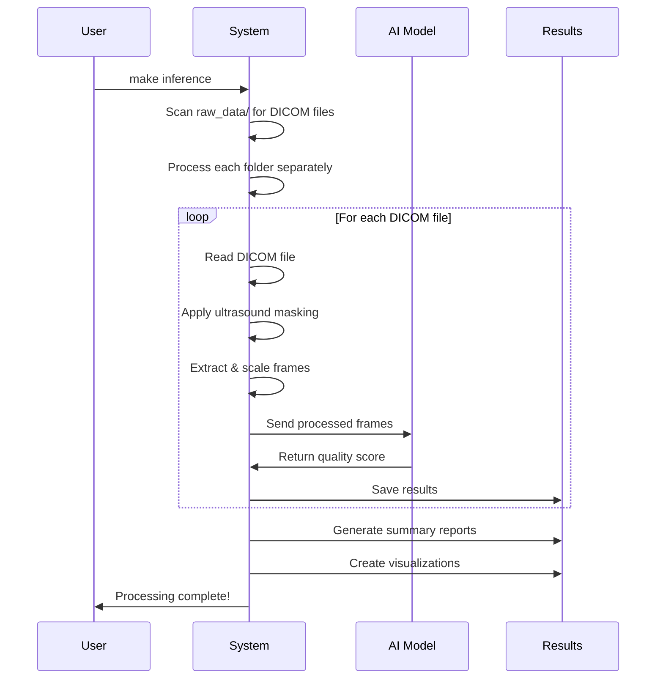

# 🚀 Getting Started with EchoQuality

This guide will walk you through setting up and running your first echo quality assessment with EchoQuality.

## 📋 Prerequisites

- **Python 3.8+** with Poetry package manager
- **Git** for cloning repositories
- **CUDA-compatible GPU** (optional, but recommended for faster processing)
- **At least 4GB RAM** for model inference
- **DICOM echo files** to analyze

## 🛠️ Installation & Setup

### Step 1: Environment Setup

```bash
# Navigate to the echoquality directory
cd models.echoquality

# Initialize Poetry environment and install dependencies
make init
```

This command will:
- Install all Python dependencies via Poetry
- Create necessary directories (`raw_data`, `preprocessed_data`, `results`, `weights`, `training_data`)

### Step 2: Download Model Weights

```bash
# Download pre-trained model weights and embeddings
make download-weights
```

This downloads:
- `video_quality_model.pt` - Main quality assessment model
- `echo_prime_encoder.pt` - Feature extraction model
- `view_classifier.ckpt` - View classification model
- `candidates_data/` - Reference embeddings

**Note**: Downloads are ~500MB total and may take a few minutes.

## 📁 Data Organization

### Directory Structure

EchoQuality expects your DICOM files to be organized in a specific way:

```
raw_data/                                    # Your input directory
├── patient_001_device_A_study_001/          # One folder per patient/device/study
│   ├── view1.dcm                           # DICOM files
│   ├── view2.dcm
│   └── view3.dcm
├── patient_002_device_B_study_001/
│   ├── apical_4ch.dcm
│   └── parasternal_long.dcm
└── patient_003_device_A_study_002/
    ├── study_file1.dcm
    └── study_file2.dcm
```

### Key Organization Rules

1. **One folder per study**: Each folder should contain DICOM files from the same patient, using the same device, during the same study session
2. **Descriptive folder names**: Use meaningful names that help identify the patient, device, and study
3. **DICOM files only**: Place only `.dcm` files in these folders

### Data Flow Diagram



## 🏃‍♂️ Running Your First Analysis

### Quick Start Command

```bash
# Run quality assessment on all DICOM files in raw_data/
make inference
```

This single command will:
1. Process all DICOM files in `raw_data/`
2. Extract and save processed images to `preprocessed_data/`
3. Run AI quality assessment
4. Generate comprehensive reports in `results/inference_output/`

### What Happens During Processing



### Expected Output

After running `make inference`, you'll see:

```
🧹 Cleaning preprocessed_data/ directory...
✅ Created fresh preprocessed_data/ directory
🧹 Cleaning results/ directory...
✅ Created fresh results/ directory
Using device: cuda
Loading model from weights/video_quality_model.pt...
Model loaded successfully!
Found 3 folders to process: ['device_A', 'device_B', 'device_C']

Processing folder: device_A
Processing 15 files from raw_data/device_A
Processing: 100%|████████████| 15/15 [00:45<00:00,  3.02s/it]

Processing folder: device_B
Processing 12 files from raw_data/device_B
Processing: 100%|████████████| 12/12 [00:38<00:00,  3.17s/it]

================================================================================
ECHO QUALITY INFERENCE SUMMARY
================================================================================
Total folders processed: 3
Successful: 3
Failed: 0
Total files found: 42
Total files processed: 40
Overall pass rate: 75.0% (30/40)

✓ device_A                        13/15 files  Pass:  76.9%
✓ device_B                        10/12 files  Pass:  70.0%
✓ device_C                        17/15 files  Pass:  76.5%

Detailed results saved to: results/inference_output
```

## 📊 Understanding Your Results

### Result Directory Structure

```
results/inference_output/
├── summary.json                           # Overall summary across all devices
├── device_A/
│   ├── folder_summary.json               # Device-specific summary
│   ├── inference_results.json            # Detailed per-file results
│   ├── score_distribution.png            # Quality score histogram
│   ├── pass_fail_distribution.png        # Pass/fail pie chart
│   └── device_A_failed_files.json       # Error details (if any)
├── device_B/
│   └── ...
└── device_C/
    └── ...
```

### Quality Score Interpretation

| Score | Quality | Meaning | Action |
|-------|---------|---------|--------|
| 0.8-1.0 | **Excellent** | Perfect for analysis | ✅ Use confidently |
| 0.6-0.8 | **Good** | Minor issues only | ✅ Generally usable |
| 0.3-0.6 | **Acceptable** | Some quality concerns | ⚠️ Review manually |
| 0.2-0.3 | **Poor** | Significant problems | ❌ Consider retaking |
| 0.1-0.2 | **Very Poor** | Major acquisition issues | ❌ Retake required |
| 0.0-0.1 | **Critical** | Severe technical problems | ❌ Check equipment |

### Sample Results File

**inference_results.json**:
```json
{
  "study1.dcm": {
    "score": 0.85,
    "status": "PASS",
    "assessment": "Excellent quality",
    "path": "/path/to/study1.dcm"
  },
  "study2.dcm": {
    "score": 0.15,
    "status": "FAIL",
    "assessment": "Very poor quality - significant issues",
    "path": "/path/to/study2.dcm"
  }
}
```

## 🔍 Advanced Options

### Custom Quality Threshold

```bash
# Use a stricter quality threshold (default is 0.3)
poetry run python -m inference.inference --threshold 0.5
```

### Enable GradCAM Visualizations

```bash
# Generate AI attention maps to see what the model focuses on
poetry run python -m inference.inference --gradcam
```

### Process Custom Directory

```bash
# Process DICOM files from a different directory
poetry run python -m inference.inference --data_dir ./my_custom_data
```

### GPU vs CPU Processing

```bash
# Force CPU processing (if GPU issues)
poetry run python -m inference.inference --device cpu

# Force GPU processing
poetry run python -m inference.inference --device cuda
```

## 🎨 Visualization and Analysis

### Generate Comprehensive Visualizations

```bash
# Create detailed charts and analysis
make visualize
```

This creates additional visualizations in `results/visualization_output/`:
- Cross-device quality comparisons
- Temporal quality trends
- Error pattern analysis
- Device performance summaries

### View Results in Jupyter

```bash
# Launch interactive Jupyter notebook
make jupyter
```

Access the notebook at `http://localhost:8888` to:
- Explore results interactively
- Create custom visualizations
- Perform statistical analysis
- Generate reports

## 🐛 Troubleshooting Common Issues

### Issue: "No DICOM files found"

**Solution**: Check your directory structure
```bash
# Verify your raw_data structure
ls -la raw_data/
ls -la raw_data/*/
```

### Issue: "CUDA out of memory"

**Solutions**:
```bash
# Use CPU instead
poetry run python -m inference.inference --device cpu

# Or reduce batch processing (edit inference.py)
```

### Issue: "Model weights not found"

**Solution**: Re-download weights
```bash
make download-weights
```

### Issue: Many files failing processing

**Solution**: Use debug tools
```bash
# Debug a specific problematic file
python -m scripts.debug_scaling ./raw_data/device_A/problematic_file.dcm
```

## 📈 Performance Optimization

### Processing Speed Tips

1. **Use GPU**: Ensure CUDA is available for 3-5x speedup
2. **Organize data**: Keep DICOM files in separate device folders
3. **Clean directories**: Remove non-DICOM files from raw_data/
4. **Monitor resources**: Watch RAM usage for large datasets

### Expected Processing Times

| Dataset Size | GPU Time | CPU Time |
|--------------|----------|----------|
| 10 files | ~30 seconds | ~2 minutes |
| 50 files | ~2 minutes | ~8 minutes |
| 100 files | ~4 minutes | ~15 minutes |
| 500 files | ~20 minutes | ~75 minutes |

## 🎯 Next Steps

### For Basic Users
1. **Review Results**: Check the generated reports and visualizations
2. **Understand Scores**: Learn the quality scoring system
3. **Filter Data**: Use results to identify high/low quality studies

### For Advanced Users
1. **Custom Training**: Train the model on your specific data
2. **Integration**: Integrate results into your clinical workflow
3. **Batch Processing**: Set up automated processing pipelines

### For Developers
1. **API Integration**: Use the Python API for custom applications
2. **Model Customization**: Modify the model architecture
3. **Pipeline Extension**: Add custom preprocessing steps

## 📚 Additional Resources

- **[Pipeline Documentation](PIPELINE.md)**: Technical details of the processing pipeline
- **[Training Guide](TRAINING.md)**: How to train the model on your data
- **[Debug Tools Guide](DEBUG_TOOLS.md)**: Troubleshooting specific files
- **[Command Reference](COMMAND_REFERENCE.md)**: Complete command documentation

---

**Congratulations!** 🎉 You've successfully run your first echo quality assessment. Check out the [Pipeline Documentation](PIPELINE.md) to learn more about how the system works under the hood.
