# 🔍 Quality Scoring Guide

Comprehensive guide to understanding EchoQuality's scoring system, thresholds, and quality assessment methodology.

## 🎯 Scoring Overview

EchoQuality uses a sophisticated AI model to generate continuous quality scores from 0.0 to 1.0, where higher scores indicate better image quality. These scores are then converted to pass/fail classifications based on configurable thresholds.

```mermaid
graph LR
    A[Echo Video] --> B[R2+1D CNN Model]
    B --> C[Quality Score 0.0-1.0]
    C --> D{Score ≥ Threshold?}
    D -->|Yes| E[PASS]
    D -->|No| F[FAIL]
    
    style A fill:#e3f2fd
    style B fill:#f3e5f5
    style E fill:#e8f5e8
    style F fill:#ffebee
```



## 📊 Quality Score Scale

### Detailed Score Interpretation

| Score Range | Quality Level | Clinical Interpretation | Recommended Action | Typical Issues |
|-------------|---------------|------------------------|-------------------|----------------|
| **0.9 - 1.0** | **Exceptional** | Perfect for all clinical purposes | ✅ Use with full confidence | None |
| **0.8 - 0.9** | **Excellent** | High-quality, suitable for detailed analysis | ✅ Proceed with analysis | Minor artifacts |
| **0.7 - 0.8** | **Very Good** | Good quality with minimal issues | ✅ Generally usable | Slight noise/blur |
| **0.6 - 0.7** | **Good** | Acceptable quality for most purposes | ✅ Usable for routine analysis | Moderate artifacts |
| **0.5 - 0.6** | **Fair** | Usable but with noticeable limitations | ⚠️ Use with caution | Quality concerns |
| **0.4 - 0.5** | **Marginal** | Borderline acceptable quality | ⚠️ Manual review recommended | Significant issues |
| **0.3 - 0.4** | **Poor** | Below standard quality | ❌ Consider retaking | Major problems |
| **0.2 - 0.3** | **Very Poor** | Significant quality problems | ❌ Retake recommended | Severe artifacts |
| **0.1 - 0.2** | **Critical** | Major acquisition issues | ❌ Retake required | Equipment issues |
| **0.0 - 0.1** | **Unacceptable** | Severe technical problems | ❌ Check equipment | System failure |

### Visual Quality Examples


## ⚙️ Threshold Configuration

### Default Threshold: 0.3

The default threshold of 0.3 is designed to balance sensitivity and specificity:
- **Pass Rate**: Typically 70-85% of clinical echo studies
- **False Positive Rate**: ~5-10% (good studies marked as poor)
- **False Negative Rate**: ~10-15% (poor studies marked as good)

### Threshold Selection Guidelines

#### Conservative Threshold (0.5-0.7)
**Use when**: High quality requirements, research studies, critical diagnoses
```bash
poetry run python -m inference.inference --threshold 0.6
```
**Characteristics**:
- Higher quality standards
- Lower pass rates (50-70%)
- Fewer false negatives
- More manual review required

#### Standard Threshold (0.3-0.5)
**Use when**: Routine clinical workflow, balanced approach
```bash
poetry run python -m inference.inference --threshold 0.3  # Default
```
**Characteristics**:
- Balanced sensitivity/specificity
- Moderate pass rates (70-85%)
- Good clinical workflow integration

#### Liberal Threshold (0.1-0.3)
**Use when**: Resource constraints, screening applications
```bash
poetry run python -m inference.inference --threshold 0.2
```
**Characteristics**:
- Lower quality standards
- Higher pass rates (85-95%)
- More false negatives
- Minimal manual review

### Threshold Optimization

#### ROC Curve Analysis
```python
from sklearn.metrics import roc_curve, auc
import matplotlib.pyplot as plt

# Generate ROC curve for your dataset
fpr, tpr, thresholds = roc_curve(true_labels, predicted_scores)
roc_auc = auc(fpr, tpr)

# Plot ROC curve
plt.figure(figsize=(8, 6))
plt.plot(fpr, tpr, label=f'ROC Curve (AUC = {roc_auc:.2f})')
plt.plot([0, 1], [0, 1], 'k--', label='Random')
plt.xlabel('False Positive Rate')
plt.ylabel('True Positive Rate')
plt.title('ROC Curve for Quality Assessment')
plt.legend()
plt.show()

# Find optimal threshold (Youden's J statistic)
optimal_idx = np.argmax(tpr - fpr)
optimal_threshold = thresholds[optimal_idx]
print(f"Optimal threshold: {optimal_threshold:.3f}")
```

## 🧠 Model Understanding

### What the Model Evaluates

#### Technical Quality Factors
1. **Image Clarity**: Sharpness and focus of ultrasound structures
2. **Contrast Resolution**: Ability to distinguish between tissues
3. **Noise Level**: Amount of electronic or acoustic noise
4. **Gain Settings**: Appropriate brightness and contrast
5. **Depth Penetration**: Adequate visualization depth

#### Acquisition Quality Factors
1. **Probe Positioning**: Optimal acoustic window
2. **Patient Positioning**: Appropriate patient orientation
3. **Breathing Artifacts**: Motion-related degradation
4. **Cardiac Rhythm**: Impact of arrhythmias on image quality
5. **Operator Technique**: Skill-dependent factors

#### Anatomical Factors
1. **View Optimization**: Standard echocardiographic views
2. **Structure Visibility**: Clear visualization of cardiac structures
3. **Doppler Quality**: Color and spectral Doppler optimization
4. **Measurement Feasibility**: Ability to perform accurate measurements

### Model Limitations

#### What the Model Cannot Assess
- **Clinical Interpretation**: Pathological findings
- **Measurement Accuracy**: Quantitative assessment quality
- **Protocol Compliance**: Adherence to imaging protocols
- **Patient-Specific Factors**: Individual anatomical variations

#### Known Biases
- **Training Data**: Biased toward specific device types or populations
- **Acquisition Settings**: May favor certain gain/contrast settings
- **View Preferences**: May prefer certain echocardiographic views
- **Temporal Factors**: May not account for cardiac cycle timing

## 📈 Quality Metrics and Statistics

### Performance Metrics

#### Accuracy Metrics
```python
# Calculate comprehensive metrics
from sklearn.metrics import accuracy_score, precision_score, recall_score, f1_score

accuracy = accuracy_score(true_labels, predicted_labels)
precision = precision_score(true_labels, predicted_labels)
recall = recall_score(true_labels, predicted_labels)
f1 = f1_score(true_labels, predicted_labels)

print(f"Accuracy: {accuracy:.3f}")
print(f"Precision: {precision:.3f}")
print(f"Recall: {recall:.3f}")
print(f"F1 Score: {f1:.3f}")
```

#### Distribution Analysis
```python
import numpy as np
import matplotlib.pyplot as plt

# Analyze score distribution
scores = [result['score'] for result in inference_results.values()]

plt.figure(figsize=(12, 4))

# Histogram
plt.subplot(1, 2, 1)
plt.hist(scores, bins=20, alpha=0.7, color='blue')
plt.axvline(x=0.3, color='red', linestyle='--', label='Threshold')
plt.xlabel('Quality Score')
plt.ylabel('Count')
plt.title('Score Distribution')
plt.legend()

# Box plot
plt.subplot(1, 2, 2)
plt.boxplot(scores)
plt.ylabel('Quality Score')
plt.title('Score Statistics')

plt.tight_layout()
plt.show()

# Summary statistics
print(f"Mean: {np.mean(scores):.3f}")
print(f"Median: {np.median(scores):.3f}")
print(f"Std: {np.std(scores):.3f}")
print(f"Min: {np.min(scores):.3f}")
print(f"Max: {np.max(scores):.3f}")
```

### Quality Trends

#### Device-Specific Analysis
```python
# Analyze quality by device type
device_scores = {}
for device_folder in os.listdir('results/inference_output/'):
    if os.path.isdir(f'results/inference_output/{device_folder}'):
        with open(f'results/inference_output/{device_folder}/inference_results.json') as f:
            results = json.load(f)
            scores = [r['score'] for r in results.values()]
            device_scores[device_folder] = {
                'mean': np.mean(scores),
                'std': np.std(scores),
                'count': len(scores),
                'pass_rate': sum(1 for s in scores if s >= 0.3) / len(scores)
            }

# Display device comparison
for device, stats in device_scores.items():
    print(f"{device}: Mean={stats['mean']:.3f}, Pass Rate={stats['pass_rate']:.1%}")
```

## 🎯 Clinical Applications

### Workflow Integration

#### Pre-Screening Workflow

```mermaid
sequenceDiagram
    participant T as Technician
    participant S as EchoQuality System
    participant C as Cardiologist
    
    T->>S: Upload echo study
    S->>S: Process and score
    S->>T: Return quality assessment
    
    alt Score ≥ 0.6 (High Quality)
        T->>C: Send for interpretation
    else Score 0.3-0.6 (Moderate Quality)
        T->>T: Review and potentially retake
        T->>C: Send with quality note
    else Score < 0.3 (Poor Quality)
        T->>T: Retake study
    end
```


#### Quality Control Workflow


### Use Case Examples

#### Research Study Quality Control
```bash
# Strict quality requirements for research
poetry run python -m inference.inference --threshold 0.7

# Generate detailed quality report
make visualize
```

#### Clinical Workflow Optimization
```bash
# Balanced approach for clinical use
poetry run python -m inference.inference --threshold 0.3

# Monitor quality trends over time
python scripts/quality_trend_analysis.py
```

#### Equipment Validation
```bash
# Compare quality across different devices
poetry run python -m inference.inference --data_dir ./device_comparison

# Generate device-specific reports
python scripts/device_quality_comparison.py
```

## 🔧 Customization and Calibration

### Custom Threshold Determination

#### Method 1: Expert Annotation
1. Have experts manually grade a subset of studies
2. Compare expert grades with model scores
3. Find threshold that best matches expert consensus

#### Method 2: Clinical Outcome Correlation
1. Correlate quality scores with diagnostic accuracy
2. Identify score threshold that maintains clinical performance
3. Validate on independent dataset

#### Method 3: ROC Optimization
1. Use ground truth quality labels
2. Generate ROC curve
3. Select threshold that optimizes desired metric (sensitivity/specificity)

### Model Fine-Tuning

For institution-specific optimization:
```bash
# Prepare training data from your assessments
make training-data

# Train custom model
make train

# Evaluate performance
python -m training.echo_model_evaluation
```

## 📊 Quality Reporting

### Automated Reports

#### Daily Quality Summary
```python
def generate_daily_report(results_dir):
    """Generate daily quality summary report."""
    summary = {
        'total_studies': 0,
        'pass_count': 0,
        'mean_score': 0,
        'device_breakdown': {}
    }
    
    # Process results and generate report
    # ... implementation details ...
    
    return summary
```

#### Trend Analysis
```python
def analyze_quality_trends(historical_data):
    """Analyze quality trends over time."""
    trends = {
        'weekly_pass_rates': [],
        'score_trends': [],
        'device_performance': {}
    }
    
    # Analyze trends and generate insights
    # ... implementation details ...
    
    return trends
```

---

## 🔗 Related Documentation

- **[Getting Started Guide](GETTING_STARTED.md)** - Basic setup and usage
- **[Pipeline Documentation](PIPELINE.md)** - Technical pipeline details
- **[Training Guide](TRAINING.md)** - Model customization
- **[Troubleshooting Guide](TROUBLESHOOTING.md)** - Common issues and solutions

---

**Understanding quality scores is crucial for effective use of EchoQuality.** Use this guide to interpret results, set appropriate thresholds, and integrate quality assessment into your clinical workflow.
