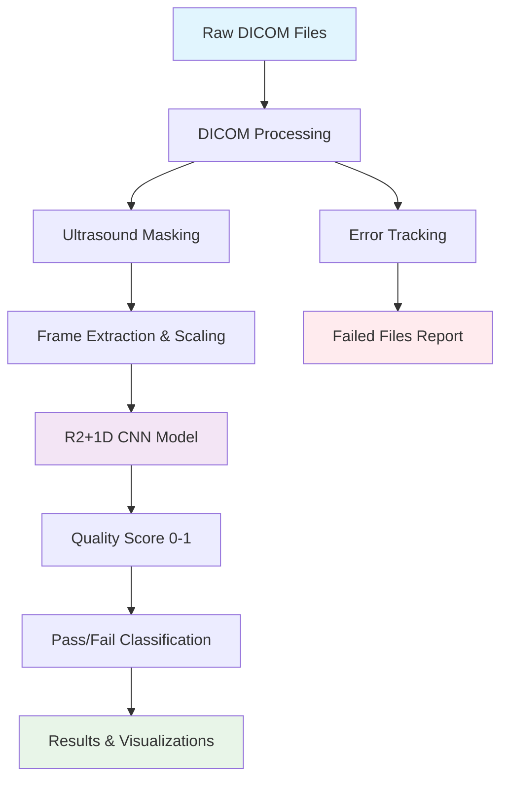
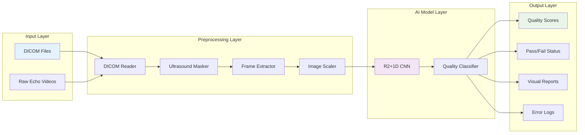
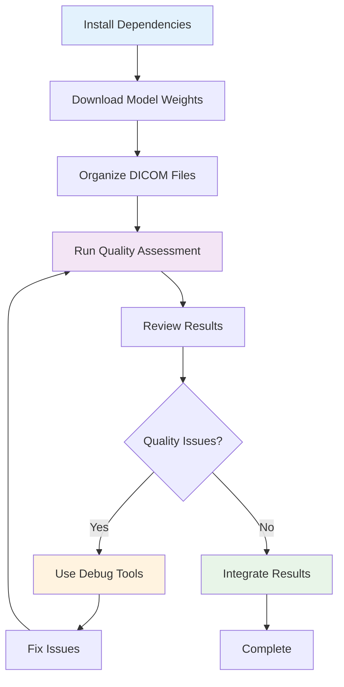

# EchoQuality Documentation

Welcome to the comprehensive documentation for EchoQuality - an AI-powered echocardiogram quality assessment pipeline.

## 🎯 What is EchoQuality?

EchoQuality is a machine learning system that automatically evaluates the quality of echocardiogram (echo) DICOM files. It uses a pre-trained R(2+1)D convolutional neural network to analyze echo videos and classify them as acceptable or poor quality, helping healthcare professionals filter out low-quality studies that might lead to inaccurate diagnoses.

## 📋 Quick Start

### 1. Setup Environment
```bash
# Initialize Poetry environment and download model weights
make init
make download-weights
```

### 2. Prepare Your Data
Place your DICOM files in the `raw_data/` directory:
```
raw_data/
├── patient_001_device_A_study_001/
│   ├── view1.dcm
│   ├── view2.dcm
│   └── view3.dcm
└── patient_002_device_B_study_001/
    ├── apical_4ch.dcm
    └── parasternal_long.dcm
```

### 3. Run Quality Assessment
```bash
# Run inference on all DICOM files
make inference
```

### 4. View Results
Check the results in:
- `preprocessed_data/` - Extracted and processed images
- `results/inference_output/` - Quality scores and analysis reports

## 📊 System Overview



## 📚 Documentation Structure

### Core Guides
- **[🚀 Getting Started Guide](GETTING_STARTED.md)** - Complete setup and first run
- **[⚙️ Pipeline Documentation](PIPELINE.md)** - Detailed technical pipeline explanation
- **[🎓 Training Guide](TRAINING.md)** - Model training and fine-tuning
- **[🔧 Debug Tools Guide](DEBUG_TOOLS.md)** - Troubleshooting and debugging utilities

### Reference Materials
- **[📖 Command Reference](COMMAND_REFERENCE.md)** - All available commands and options
- **[📁 File Structure Guide](FILE_STRUCTURE.md)** - Project organization and data flow
- **[🔍 Quality Scoring Guide](QUALITY_SCORING.md)** - Understanding quality scores and thresholds
- **[❗ Troubleshooting Guide](TROUBLESHOOTING.md)** - Common issues and solutions

## 🎯 Key Features

### 🤖 AI-Powered Quality Assessment
- **R(2+1)D CNN Model**: Advanced 3D convolutional neural network for video analysis
- **Quality Scoring**: Continuous scores from 0-1 with detailed quality descriptions
- **Pass/Fail Classification**: Configurable threshold-based classification (default: 0.3)

### 🖼️ Advanced Image Processing
- **Automatic Ultrasound Masking**: Removes non-ultrasound regions and artifacts
- **Frame Extraction**: Intelligent sampling of representative frames
- **Standardized Preprocessing**: Consistent 112x112 pixel scaling and normalization

### 📊 Comprehensive Reporting
- **Device-Level Analysis**: Separate reports for each ultrasound device
- **Error Categorization**: Six types of error tracking with detailed logs
- **Visual Analytics**: Score distributions, pass/fail charts, and trend analysis
- **JSON Output**: Machine-readable results for integration

### 🛠️ Debug & Visualization Tools
- **GradCAM Visualizations**: See what the model focuses on
- **Mask Debug Images**: Visualize preprocessing steps
- **Specialized Debug Tools**: Four different debugging utilities for troubleshooting

## 🏗️ Architecture Overview



## 🎯 Use Cases

### 🏥 Clinical Workflow Integration
- **Pre-screening**: Automatically filter poor-quality studies before manual review
- **Quality Control**: Ensure consistent image quality across different devices
- **Training**: Identify common quality issues for technician training

### 🔬 Research Applications
- **Dataset Curation**: Build high-quality datasets for research studies
- **Multi-center Studies**: Standardize quality assessment across institutions
- **Algorithm Development**: Baseline quality assessment for other AI models

### 🏭 Device Validation
- **Equipment Testing**: Assess image quality across different ultrasound devices
- **Maintenance Scheduling**: Identify devices producing consistently poor images
- **Procurement Decisions**: Compare image quality between device models

## 📈 Quality Assessment Scale

| Score Range | Quality Level | Description | Recommended Action |
|-------------|---------------|-------------|-------------------|
| 0.8 - 1.0 | **Excellent** | High-quality images suitable for analysis | ✅ Proceed with analysis |
| 0.6 - 0.8 | **Good** | Acceptable quality with minor issues | ✅ Usable for most purposes |
| 0.3 - 0.6 | **Acceptable** | Usable but may have quality concerns | ⚠️ Review manually |
| 0.2 - 0.3 | **Poor** | Significant quality issues | ❌ Consider retaking |
| 0.1 - 0.2 | **Very Poor** | Major acquisition problems | ❌ Retake required |
| 0.0 - 0.1 | **Critical** | Severe technical issues | ❌ Check equipment |

## 🚀 Getting Started Workflow



## 🔗 Quick Navigation

### For New Users
1. [🚀 Getting Started Guide](GETTING_STARTED.md) - Start here!
2. [📖 Command Reference](COMMAND_REFERENCE.md) - Learn the commands
3. [🔍 Quality Scoring Guide](QUALITY_SCORING.md) - Understand the results

### For Advanced Users
1. [⚙️ Pipeline Documentation](PIPELINE.md) - Technical details
2. [🎓 Training Guide](TRAINING.md) - Customize the model
3. [🔧 Debug Tools Guide](DEBUG_TOOLS.md) - Troubleshoot issues

### For Developers
1. [📁 File Structure Guide](FILE_STRUCTURE.md) - Code organization
2. [❗ Troubleshooting Guide](TROUBLESHOOTING.md) - Common issues
3. [API Documentation](../README.md#api-usage) - Integration guide

## 🆘 Need Help?

- **Common Issues**: Check the [Troubleshooting Guide](TROUBLESHOOTING.md)
- **Debug Tools**: Use the [Debug Tools Guide](DEBUG_TOOLS.md) for file-specific issues
- **Technical Details**: See the [Pipeline Documentation](PIPELINE.md)
- **Training Questions**: Refer to the [Training Guide](TRAINING.md)

---

**Next Steps**: Start with the [🚀 Getting Started Guide](GETTING_STARTED.md) to run your first quality assessment!
