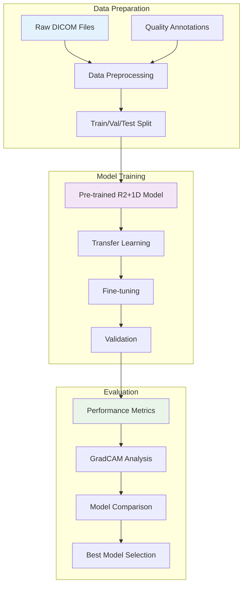

# 🎓 EchoQuality Training Guide

Comprehensive guide for training and fine-tuning the EchoQuality model on your custom dataset.

## 🎯 Training Overview

EchoQuality uses a pre-trained R(2+1)D convolutional neural network that can be fine-tuned on your specific dataset. The training pipeline supports transfer learning, data augmentation, and comprehensive evaluation to ensure optimal performance on your echo data.



## 🛠️ Training Components

The training system consists of three main components:

1. **`train_quality_model.py`** - Main training script with MLflow integration
2. **`echo_data_augmentation.py`** - Advanced data augmentation utilities
3. **`echo_model_evaluation.py`** - Comprehensive model evaluation and visualization

## Prerequisites

Ensure you have all the required dependencies installed:

```bash
pip install torch torchvision tqdm opencv-python pydicom numpy pandas matplotlib seaborn scikit-learn mlflow
```

## Preparing Your Data

1. Organize your 100 annotated echo videos in a directory (e.g., `echo_videos/`).
2. Prepare a CSV file with annotations (e.g., `echo_annotations.csv`) with at least the following columns:
   - `video_path`: Path to the DICOM file
   - `quality_score`: Quality score (you can use a binary 0/1 or a continuous score)

Example CSV format:
```
video_path,quality_score
echo_videos/video1.dcm,1
echo_videos/video2.dcm,0
...
```

## Configuration

Edit the configuration section at the top of `train_quality_model.py` to match your setup:

```python
# Configuration
BATCH_SIZE = 8
EPOCHS = 20
LEARNING_RATE = 1e-4
WEIGHT_DECAY = 1e-5
DEVICE = torch.device("cuda" if torch.cuda.is_available() else "cpu")
ANNOTATIONS_CSV = "echo_annotations.csv"  # Path to your CSV annotations
VIDEOS_DIR = "echo_videos"  # Directory containing your 100 echo videos
MODEL_WEIGHTS = "video_quality_model.pt"  # Path to your current model weights
SAVE_DIR = "trained_models"  # Directory to save trained models
USE_MLFLOW = True  # Set to False to disable MLflow tracking
NUM_UNFROZEN_LAYERS = 2  # Number of layers to unfreeze for fine-tuning
```

## Training Process

### 1. Basic Training

To start training with the default configuration:

```bash
python train_quality_model.py
```

This will:
- Load your annotations from the CSV file
- Split the preprocessed_data into training, validation, and test sets
- Load the pre-trained model
- Freeze early layers and only train the final layers
- Train for the specified number of epochs
- Save the best model based on validation loss
- Evaluate the model on the test set
- Log metrics and artifacts to MLflow (if enabled)

### 2. Using Data Augmentation

To incorporate data augmentation, modify the `train_quality_model.py` script to use the augmentation classes from `echo_data_augmentation.py`:

```python
from echo_data_augmentation import EchoVideoAugmentation

# Create augmentation
augmentation = EchoVideoAugmentation(
    brightness_range=(0.9, 1.1),
    contrast_range=(0.9, 1.1),
    rotation_range=(-5, 5),
    translation_range=(-0.05, 0.05),
    zoom_range=(0.95, 1.05),
    noise_level=(0.0, 0.02),
    temporal_crop_range=(0.9, 1.0),
    temporal_mask_prob=0.05,
    transform_prob=0.5
)

# Apply to your preprocessed_data
train_dataset = EchoDataset(train_paths, train_labels, transform=augmentation)
```

### 3. Creating Synthetic Low-Quality Pairs

If you want to create synthetic low-quality versions of your high-quality videos for paired training:

```python
from echo_data_augmentation import create_synthetic_low_quality

# For each high-quality video
for video in high_quality_videos:
    # Create a synthetic low-quality version
    lq_video = create_synthetic_low_quality(
        video, 
        noise_level=0.2, 
        blur_kernel=5, 
        contrast_reduction=0.5
    )
    
    # Use the pair for training
    # ...
```

## Evaluation and Visualization

After training, you can use the functions in `echo_model_evaluation.py` to evaluate and visualize your model:

### 1. Evaluating the Model

```python
from echo_model_evaluation import evaluate_model, log_evaluation_to_mlflow

# Evaluate the model
metrics = evaluate_model(model, test_loader, device)

# Print metrics
print(f"Accuracy: {metrics['accuracy']:.4f}")
print(f"Precision: {metrics['precision']:.4f}")
print(f"Recall: {metrics['recall']:.4f}")
print(f"F1 Score: {metrics['f1']:.4f}")
print(f"ROC AUC: {metrics['roc_auc']:.4f}")

# Log to MLflow
log_evaluation_to_mlflow(metrics, prefix="test_")
```

### 2. Visualizing with GradCAM

GradCAM helps visualize which parts of the echo video the model is focusing on for its predictions:

```python
from echo_model_evaluation import visualize_gradcam

# Visualize GradCAM for a video
gradcam_frames = visualize_gradcam(
    model, 
    video, 
    target_layer_name="layer4", 
    save_path="gradcam_visualization.png"
)
```

### 3. Analyzing Misclassifications

To understand where your model is making mistakes:

```python
from echo_model_evaluation import analyze_misclassifications

# Analyze misclassifications
false_positives, false_negatives = analyze_misclassifications(
    model, 
    test_loader, 
    device, 
    save_dir="misclassifications"
)
```

## Advanced Training Techniques

### 1. Progressive Unfreezing

Instead of unfreezing a fixed number of layers, you can progressively unfreeze more layers as training progresses:

```python
# Start with only the final layer unfrozen
freeze_model_except_final_layers(model, num_layers_to_train=1)

# Train for a few epochs
train_epoch(model, train_loader, criterion, optimizer, device)

# Unfreeze more layers
freeze_model_except_final_layers(model, num_layers_to_train=2)

# Train for more epochs
train_epoch(model, train_loader, criterion, optimizer, device)

# Unfreeze even more layers
freeze_model_except_final_layers(model, num_layers_to_train=3)

# Train for final epochs
train_epoch(model, train_loader, criterion, optimizer, device)
```

### 2. Learning Rate Scheduling

The training script already includes a ReduceLROnPlateau scheduler, but you can experiment with other schedulers:

```python
# Cosine annealing with warm restarts
scheduler = torch.optim.lr_scheduler.CosineAnnealingWarmRestarts(
    optimizer, 
    T_0=5,  # Restart every 5 epochs
    T_mult=2  # Double the restart period after each restart
)
```

### 3. Focal Loss for Imbalanced Data

If your preprocessed_data has imbalanced classes, you can use Focal Loss instead of BCE:

```python
class FocalLoss(nn.Module):
    def __init__(self, alpha=0.25, gamma=2):
        super(FocalLoss, self).__init__()
        self.alpha = alpha
        self.gamma = gamma
        
    def forward(self, inputs, targets):
        BCE_loss = F.binary_cross_entropy_with_logits(inputs, targets, reduction='none')
        pt = torch.exp(-BCE_loss)
        F_loss = self.alpha * (1-pt)**self.gamma * BCE_loss
        return F_loss.mean()

# Use Focal Loss
criterion = FocalLoss(alpha=0.25, gamma=2)
```

## MLflow Tracking

The training script is integrated with MLflow for experiment tracking. If enabled, it will log:

- Parameters (learning rate, batch size, etc.)
- Metrics (loss, accuracy, etc.)
- Artifacts (model checkpoints, plots, etc.)

To view the MLflow UI:

```bash
mlflow ui
```

Then open http://localhost:5000 in your browser.

## Troubleshooting

### CUDA Out of Memory

If you encounter CUDA out of memory errors:
- Reduce the batch size
- Use gradient accumulation
- Process videos at a lower resolution

### Slow Training

If training is too slow:
- Preprocess and cache the videos
- Use fewer workers for the data loader
- Reduce the number of frames per video

### Poor Performance

If the model is not performing well:
- Try different augmentation strategies
- Experiment with different learning rates
- Unfreeze more layers of the model
- Use a different loss function
- Balance your preprocessed_data

## Next Steps

After training your model, you can:

1. Deploy it for inference on new echo videos
2. Integrate it with your clinical workflow
3. Extend it to detect specific quality issues
4. Combine it with other echo analysis models

For any questions or issues, please refer to the project documentation or contact the maintainers.
