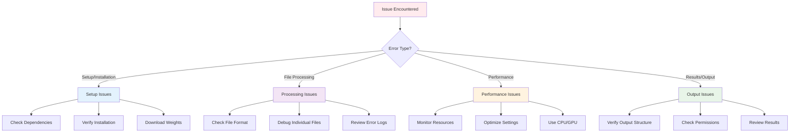

# ❗ Troubleshooting Guide

Comprehensive troubleshooting guide for common EchoQuality issues, with step-by-step solutions and diagnostic procedures.

## 🚨 Quick Issue Resolution

### Emergency Fixes

| Issue | Quick Fix | Time |
|-------|-----------|------|
| "No DICOM files found" | Check `raw_data/` directory structure | 30 seconds |
| "Model weights not found" | Run `make download-weights` | 5 minutes |
| "CUDA out of memory" | Add `--device cpu` to command | Immediate |
| "Permission denied" | Check directory write permissions | 1 minute |
| "Poetry not found" | Install Poetry: `curl -sSL https://install.python-poetry.org \| python3 -` | 2 minutes |

## 🔍 Diagnostic Workflow



## 🛠️ Setup and Installation Issues

### Issue: Poetry Not Found
**Error**: `poetry: command not found`

**Solution**:
```bash
# Install Poetry
curl -sSL https://install.python-poetry.org | python3 -

# Add to PATH (add to ~/.bashrc or ~/.zshrc)
export PATH="$HOME/.local/bin:$PATH"

# Reload shell
source ~/.bashrc  # or source ~/.zshrc

# Verify installation
poetry --version
```

**Alternative**: Use pip instead
```bash
pip install poetry
```

---

### Issue: Python Version Incompatibility
**Error**: `Python 3.8+ required`

**Solution**:
```bash
# Check current Python version
python3 --version

# Install Python 3.8+ (Ubuntu/Debian)
sudo apt update
sudo apt install python3.8 python3.8-pip

# Install Python 3.8+ (macOS with Homebrew)
brew install python@3.8

# Install Python 3.8+ (Windows)
# Download from https://www.python.org/downloads/
```

---

### Issue: Dependencies Installation Fails
**Error**: Various dependency installation errors

**Solution**:
```bash
# Clear Poetry cache
poetry cache clear pypi --all

# Update Poetry
poetry self update

# Install with verbose output
poetry install -vvv

# If still failing, try pip
pip install -r requirements.txt
```

**Common dependency issues**:
- **PyTorch**: Install from https://pytorch.org/get-started/locally/
- **OpenCV**: `pip install opencv-python`
- **CUDA**: Install CUDA toolkit if using GPU

---

### Issue: Model Weights Download Fails
**Error**: `Failed to download model weights`

**Solution**:
```bash
# Check internet connection
ping github.com

# Manual download
wget https://github.com/patniko/ghl/releases/download/v1.0.0/video_quality_model.pt -O weights/video_quality_model.pt

# Verify file integrity
ls -la weights/
file weights/video_quality_model.pt

# If corrupted, delete and re-download
rm weights/video_quality_model.pt
make download-weights
```

## 📁 File and Data Issues

### Issue: "No DICOM files found"
**Error**: `No folders found in raw_data`

**Diagnostic Steps**:
```bash
# Check directory structure
ls -la raw_data/
ls -la raw_data/*/

# Verify DICOM files exist
find raw_data/ -name "*.dcm" | head -10

# Check file permissions
ls -la raw_data/*/*.dcm | head -5
```

**Solutions**:
1. **Missing directory**: Create `raw_data/` and add DICOM files
2. **Wrong structure**: Organize files into patient/device/study folders
3. **File extensions**: Ensure files have `.dcm` extension
4. **Permissions**: Fix with `chmod 644 raw_data/*/*.dcm`

---

### Issue: "Invalid DICOM format"
**Error**: Files fail with "not_dicom" error

**Diagnostic Steps**:
```bash
# Test DICOM file validity
python -c "import pydicom; dcm = pydicom.dcmread('path/to/file.dcm'); print('Valid DICOM')"

# Check file headers
file raw_data/device_A/*.dcm | head -5

# Use debug tools
python -m scripts.debug_scaling /path/to/problematic/file.dcm
```

**Solutions**:
1. **Corrupted files**: Re-acquire or restore from backup
2. **Wrong format**: Convert to DICOM format
3. **Compressed DICOM**: Decompress using DICOM tools
4. **Non-standard DICOM**: Use specialized DICOM readers

---

### Issue: "Empty pixel array"
**Error**: DICOM files have no image data

**Diagnostic Steps**:
```bash
# Check DICOM metadata
python -c "
import pydicom
dcm = pydicom.dcmread('file.dcm')
print(f'Pixel array shape: {dcm.pixel_array.shape}')
print(f'Data type: {dcm.pixel_array.dtype}')
"
```

**Solutions**:
1. **Missing pixel data**: File may be metadata-only
2. **Compressed data**: Decompress using appropriate codec
3. **Transfer syntax**: Convert to uncompressed format
4. **Acquisition error**: Re-acquire the study

## 🖥️ Processing and Performance Issues

### Issue: "CUDA out of memory"
**Error**: GPU memory exhausted during processing

**Immediate Fix**:
```bash
# Use CPU instead
poetry run python -m inference.inference --device cpu
```

**Optimization Solutions**:
```bash
# Clear GPU memory
python -c "import torch; torch.cuda.empty_cache()"

# Monitor GPU usage
nvidia-smi

# Reduce batch size (edit inference.py)
# Change: batch_size = 1

# Process smaller datasets
# Split raw_data/ into smaller chunks
```

**Hardware Solutions**:
- Use GPU with more memory (8GB+ recommended)
- Close other GPU-using applications
- Restart system to clear GPU memory

---

### Issue: Slow Processing Speed
**Symptoms**: Processing takes much longer than expected

**Diagnostic Steps**:
```bash
# Monitor system resources
htop
nvidia-smi  # For GPU usage

# Time the processing
time make inference

# Profile memory usage
python -m memory_profiler inference/inference.py
```

**Optimization Solutions**:
1. **Use GPU**: Ensure CUDA is available and working
2. **Reduce file size**: Process smaller datasets
3. **Close applications**: Free up system resources
4. **SSD storage**: Use faster storage for data directories

**Expected Performance**:
- **GPU**: 2-5 seconds per file
- **CPU**: 8-15 seconds per file
- **Large files**: May take longer

---

### Issue: Memory Errors
**Error**: `MemoryError` or system freezing

**Solutions**:
```bash
# Monitor memory usage
free -h
top

# Reduce memory usage
# Process files in smaller batches
# Use CPU instead of GPU
poetry run python -m inference.inference --device cpu

# Increase swap space (Linux)
sudo fallocate -l 4G /swapfile
sudo chmod 600 /swapfile
sudo mkswap /swapfile
sudo swapon /swapfile
```

## 📊 Results and Output Issues

### Issue: Missing Output Files
**Symptoms**: Expected result files not generated

**Diagnostic Steps**:
```bash
# Check output directory
ls -la results/inference_output/

# Verify write permissions
touch results/test_file && rm results/test_file

# Check disk space
df -h

# Review console output for errors
make inference 2>&1 | tee inference.log
```

**Solutions**:
1. **Permission errors**: Fix with `chmod 755 results/`
2. **Disk space**: Free up space or use different output directory
3. **Processing errors**: Check error logs for specific issues
4. **Interrupted processing**: Re-run the inference command

---

### Issue: Incorrect Quality Scores
**Symptoms**: Quality scores don't match visual assessment

**Diagnostic Steps**:
```bash
# Use debug tools for visual analysis
python -m scripts.debug_scaling_visual /path/to/file.dcm

# Enable GradCAM to see model focus
poetry run python -m inference.inference --gradcam

# Check preprocessing steps
python -m scripts.debug_scaling /path/to/file.dcm
```

**Possible Causes**:
1. **Preprocessing issues**: Masking removing important regions
2. **Model limitations**: Model not trained on similar data
3. **File corruption**: DICOM data corruption
4. **Unusual dimensions**: Non-standard image sizes

**Solutions**:
1. **Adjust preprocessing**: Modify masking parameters
2. **Custom training**: Train model on your specific data
3. **Quality threshold**: Adjust threshold for your use case
4. **Manual review**: Combine automated and manual assessment

---

### Issue: Visualization Errors
**Error**: Charts or plots not generating correctly

**Solutions**:
```bash
# Install missing dependencies
pip install matplotlib seaborn

# Check display environment (for remote systems)
export DISPLAY=:0

# Use non-interactive backend
python -c "
import matplotlib
matplotlib.use('Agg')
import matplotlib.pyplot as plt
"

# Generate visualizations separately
make visualize
```

## 🔧 Advanced Troubleshooting

### Debug Mode Activation
```bash
# Enable verbose logging
export PYTHONPATH=$PWD
python -m inference.inference --data_dir ./raw_data --output ./results/debug_output

# Use Python debugger
python -m pdb inference/inference.py
```

### Custom Error Handling
```python
# Add to inference script for detailed error tracking
import traceback
import logging

logging.basicConfig(level=logging.DEBUG)

try:
    # Your processing code
    pass
except Exception as e:
    logging.error(f"Error processing file: {e}")
    traceback.print_exc()
```

### Performance Profiling
```bash
# Profile CPU usage
python -m cProfile -o profile.prof inference/inference.py

# Analyze profile
python -c "
import pstats
p = pstats.Stats('profile.prof')
p.sort_stats('cumulative').print_stats(10)
"

# Profile memory usage
python -m memory_profiler inference/inference.py
```

## 🔄 Recovery Procedures

### Complete Reset
```bash
# Clean everything and start fresh
make clean
rm -rf weights/
rm -rf .venv/

# Reinstall
make init
make download-weights
```

### Partial Reset
```bash
# Clean only results
make clean

# Or clean specific directories
rm -rf results/
rm -rf preprocessed_data/
```

### Backup and Restore
```bash
# Backup important data
tar -czf backup_$(date +%Y%m%d).tar.gz raw_data/ weights/

# Restore from backup
tar -xzf backup_20240101.tar.gz
```

## 📋 Diagnostic Checklist

### Pre-Processing Checklist
- [ ] Poetry installed and working
- [ ] Python 3.8+ available
- [ ] Dependencies installed successfully
- [ ] Model weights downloaded
- [ ] DICOM files in correct directory structure
- [ ] Sufficient disk space (>5GB recommended)
- [ ] Write permissions for output directories

### Processing Checklist
- [ ] DICOM files are valid format
- [ ] Files contain pixel data
- [ ] GPU/CPU resources available
- [ ] No permission errors
- [ ] Network connectivity (for downloads)

### Post-Processing Checklist
- [ ] Output files generated
- [ ] Results look reasonable
- [ ] Error logs reviewed
- [ ] Visualizations created
- [ ] Performance acceptable

## 🆘 Getting Additional Help

### Log Collection
```bash
# Collect comprehensive logs
make inference 2>&1 | tee full_inference.log

# System information
uname -a > system_info.txt
python --version >> system_info.txt
poetry --version >> system_info.txt
nvidia-smi >> system_info.txt 2>/dev/null || echo "No NVIDIA GPU" >> system_info.txt
```

### Issue Reporting Template
```
**Environment:**
- OS: [Linux/macOS/Windows]
- Python version: [3.8/3.9/3.10]
- GPU: [Yes/No, model if yes]
- Memory: [Available RAM]

**Issue:**
- Command run: [exact command]
- Error message: [full error]
- Expected behavior: [what should happen]

**Files:**
- Number of DICOM files: [count]
- File sizes: [typical size]
- DICOM source: [device/software]

**Logs:**
[Attach relevant log files]
```

### Debug Information Collection
```bash
# Create debug package
mkdir debug_package
cp debug_scaling.log debug_package/
cp -r results/debug_images/ debug_package/
cp system_info.txt debug_package/
tar -czf debug_package.tar.gz debug_package/
```

---

## 🔗 Related Documentation

- **[Getting Started Guide](GETTING_STARTED.md)** - Initial setup and first run
- **[Command Reference](COMMAND_REFERENCE.md)** - All available commands
- **[Debug Tools Guide](DEBUG_TOOLS.md)** - Specialized debugging tools
- **[Pipeline Documentation](PIPELINE.md)** - Technical pipeline details

---

**Still having issues?** Use the debug tools for file-specific problems, or collect logs and system information for further assistance.
