# Processing Pipeline
Collecting prospective multimodal data from clinical studies typically comes with fairly considerable data loss through post-cleaning and normalization. As a part of our work to collect data on 5,000 patients in India with a higher quality and completeness rate than prior studies we will leverage multiple models and standardized checks to monitor batches of clinical data collected in the study.
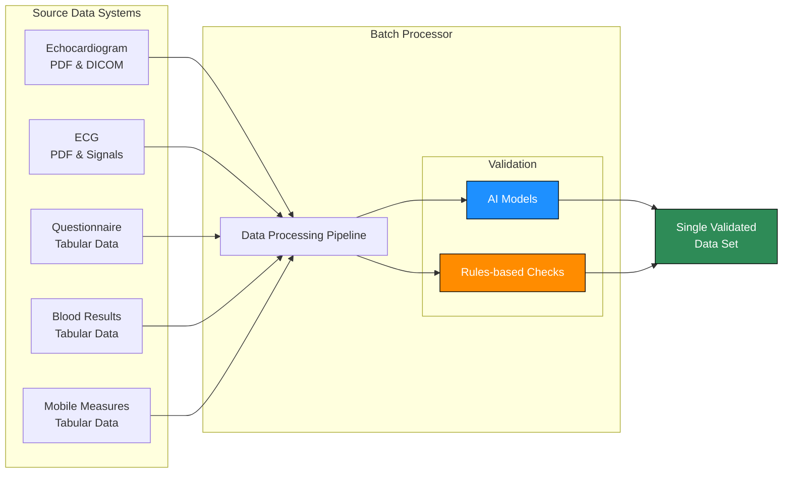


## Prospective Data

As a part of the study we are collecting data from multiple devices and integrations with hospital systems. 

- Rules based checks
    - Questionnaire: Tabular questions and answers
    - Blood results: Tabular measurements
    - Mobile measures: Tabular measurements
- Software AI checks
    - Echocardiogram: PDF report and DICOM images
    - ECG: PDF report and raw signals

## Integrated Data Model

All data sources are linked together using a unique patient identifier to form a complete patient record. The following diagram illustrates how the different data sources are connected:

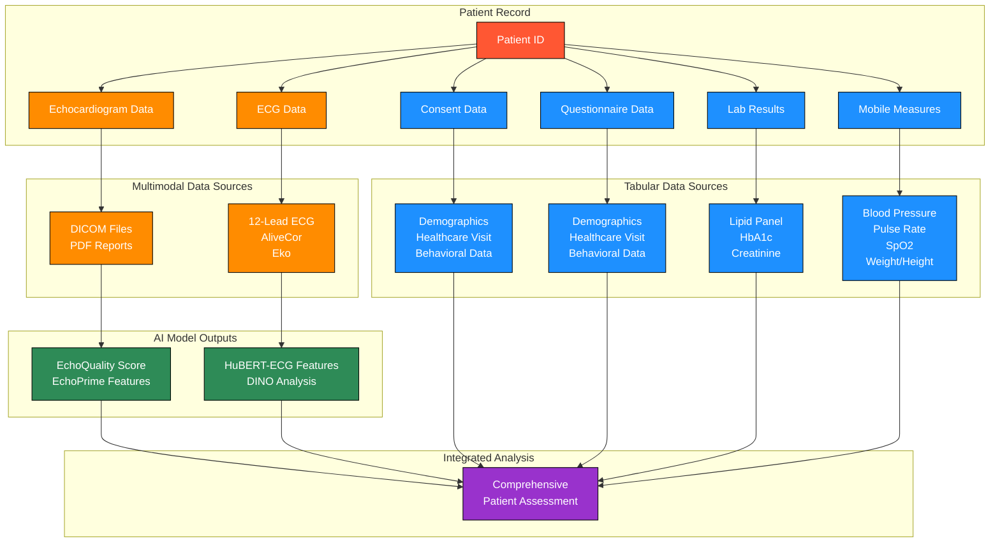

### Data Relationships

The patient identifier serves as the primary key that links all data sources:

| Data Source | Relationship to Patient | Key Fields |
|-------------|-------------------------|------------|
| **Consent Data** | One-to-one | Patient Identifier |
| **Questionnaire Data** | One-to-many (multiple questionnaires over time) | Questionnaire Identifier, Patient ID |
| **Lab Results** | One-to-many (multiple lab tests over time) | Lab Result ID, Patient ID |
| **Mobile Measures** | One-to-many (multiple measurements over time) | Measure Identifier, Patient ID |
| **Echocardiogram Data** | One-to-many (multiple studies over time) | DICOM Study ID, Patient ID |
| **ECG Data** | One-to-many (multiple recordings over time) | ECG Recording ID, Patient ID |

This integrated approach ensures that all data collected for a patient can be linked together for comprehensive analysis, while maintaining data integrity and traceability.


# Source Data

## Tabular Data

### Validation Process

```mermaid
graph LR
    subgraph "Processing"
        I[CSV File<br>Input] --> F[Format<br>Validation]
        F --> S[Schema<br>Validation]
        S --> D[Data Type<br>Validation]
        D --> R[Range<br>Validation]
        R --> V[Value Set<br>Validation]
    end
    
    subgraph "Quality Assessment"
        V --> C[Completeness<br>Check]
        C --> CO[Consistency<br>Check]
        CO --> O[Outlier<br>Detection]
    end
    
    O --> DB[Database<br>Storage]
    
    style I fill:#555,stroke:#000,color:#FFF
    style F fill:#1E90FF,stroke:#000,color:#FFF
    style S fill:#1E90FF,stroke:#000,color:#FFF
    style D fill:#1E90FF,stroke:#000,color:#FFF
    style R fill:#1E90FF,stroke:#000,color:#FFF
    style V fill:#1E90FF,stroke:#000,color:#FFF
    style C fill:#FF8C00,stroke:#000,color:#FFF
    style CO fill:#FF8C00,stroke:#000,color:#FFF
    style O fill:#FF8C00,stroke:#000,color:#FFF
    style DB fill:#2E8B57,stroke:#000,color:#FFF
```

The validation process includes:

1. **Format Validation**: Checks file format, encoding, and structure
2. **Schema Validation**: Verifies all required columns are present
3. **Data Type Validation**: Ensures values match expected data types
4. **Range Validation**: Confirms values fall within acceptable ranges
5. **Value Set Validation**: Verifies categorical values match predefined sets
6. **Completeness Check**: Identifies missing values in required fields
7. **Consistency Check**: Validates relationships between related fields
8. **Outlier Detection**: Flags statistically abnormal values for review

The basic file format specifications are:

| Specification | Requirement |
|---------------|-------------|
| **File type** | CSV (comma-separated values) |
| **Encoding** | UTF-8 |
| **Header row** | Required (first row contains column names) |
| **Delimiter** | Comma (,) |
| **Date format** | YYYY-MM-DD |
| **Time format** | HH:MM |

### **Lab Results**

Laboratory results provide critical data for patient assessment and are subject to rigorous format and validation checks to ensure data quality and consistency.

| Column Name | Data Type | Format/Values | Validation Rules | Required | Units |
|-------------|-----------|---------------|------------------|----------|-------|
| **lab_result_id** | String | Alphanumeric | Unique identifier for each lab result set | Yes | N/A |
| **patient_id** | String | Alphanumeric | Identifier linking to patient record | Yes | N/A |
| **collection_date** | Date | YYYY-MM-DD | Valid date format | Yes | N/A |
| **collection_time** | Time | HH:MM | Valid time format | Yes | N/A |
| **lab_facility** | String | Text | Name of laboratory facility | Yes | N/A |
| **ordering_provider** | String | Text | Name or ID of ordering provider | No | N/A |
| **result_status** | String | Predefined values | One of: FINAL, PRELIMINARY, CORRECTED, CANCELLED | Yes | N/A |
| **ldl** | Decimal | 0.0-999.9 | Number between 50-250 with one decimal place | No | mg/dL |
| **hdl** | Decimal | 0.0-999.9 | Number between 20-80 with one decimal place | No | mg/dL |
| **triglycerides** | Decimal | 0.0-999.9 | Number between 50-500 with one decimal place | No | mg/dL |
| **total_cholesterol** | Decimal | 0.0-999.9 | Number between 100-300 with one decimal place | No | mg/dL |
| **hba1c** | Decimal | 0.0-99.9 | Number between 5-7 with one decimal place | No | % |
| **creatinine** | Decimal | 0.00-9.99 | Number between 0.5-1.5 with two decimal places | No | mg/dL |
| **ldl_flag** | String | Predefined values | One of: NORMAL, LOW, HIGH, CRITICAL_LOW, CRITICAL_HIGH | No | N/A |
| **hdl_flag** | String | Predefined values | One of: NORMAL, LOW, HIGH, CRITICAL_LOW, CRITICAL_HIGH | No | N/A |
| **triglycerides_flag** | String | Predefined values | One of: NORMAL, LOW, HIGH, CRITICAL_LOW, CRITICAL_HIGH | No | N/A |
| **total_cholesterol_flag** | String | Predefined values | One of: NORMAL, LOW, HIGH, CRITICAL_LOW, CRITICAL_HIGH | No | N/A |
| **hba1c_flag** | String | Predefined values | One of: NORMAL, LOW, HIGH, CRITICAL_LOW, CRITICAL_HIGH | No | N/A |
| **creatinine_flag** | String | Predefined values | One of: NORMAL, LOW, HIGH, CRITICAL_LOW, CRITICAL_HIGH | No | N/A |
| **fasting_status** | String | Predefined values | One of: FASTING, NON_FASTING, UNKNOWN | No | N/A |
| **specimen_type** | String | Predefined values | One of: SERUM, PLASMA, WHOLE_BLOOD, URINE | Yes | N/A |
| **laboratory_method_ldl** | String | Text | Method used for LDL test | No | N/A |
| **laboratory_method_hdl** | String | Text | Method used for HDL test | No | N/A |
| **laboratory_method_triglycerides** | String | Text | Method used for triglycerides test | No | N/A |
| **laboratory_method_total_cholesterol** | String | Text | Method used for total cholesterol test | No | N/A |
| **laboratory_method_hba1c** | String | Text | Method used for HbA1c test | No | N/A |
| **laboratory_method_creatinine** | String | Text | Method used for creatinine test | No | N/A |

Files that pass all validation checks are stored in the database and made available for analysis. Files with validation errors are flagged for review and correction.

## **Consent Data**

Consent data is collected from study participants and undergoes validation to ensure proper documentation.

#### File Format Specifications

| Specification | Requirement |
|---------------|-------------|
| **File type** | CSV (comma-separated values) |
| **Encoding** | UTF-8 |
| **Header row** | Required (first row contains column names) |
| **Delimiter** | Comma (,) |

#### Column Specifications

The following table outlines the required columns, data types, validation rules, and units for consent data files:

| Column Name | Data Type | Format/Values | Validation Rules | Required |
|-------------|-----------|---------------|------------------|----------|
| **Patient Identifier** | String | Alphanumeric | Unique identifier for each participant | Yes |

#### Validation Process

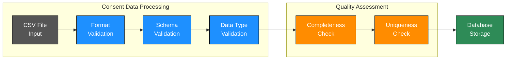

The consent data validation process includes:

1. **Format Validation**: Checks file format, encoding, and structure
2. **Schema Validation**: Verifies all required columns are present
3. **Data Type Validation**: Ensures values match expected data types
4. **Completeness Check**: Identifies missing values in required fields
5. **Uniqueness Check**: Verifies that each patient identifier is unique

Files that pass all validation checks are stored in the database and made available for analysis. Files with validation errors are flagged for review and correction.

## **Questionnaire Data**

Questionnaire data is collected from study participants and undergoes validation to ensure data quality and completeness.

#### File Format Specifications

| Specification | Requirement |
|---------------|-------------|
| **File type** | CSV (comma-separated values) |
| **Encoding** | UTF-8 |
| **Header row** | Required (first row contains column names) |
| **Delimiter** | Comma (,) |

#### Column Specifications

The following table outlines the required columns, data types, validation rules, and units for questionnaire data files:

| Column Name | Data Type | Format/Values | Validation Rules | Required |
|-------------|-----------|---------------|------------------|----------|
| **Questionnaire Identifier** | String | Alphanumeric | Unique identifier for each questionnaire | Yes |
| **Age** | Integer | 30-99 | Whole numbers within valid range | Yes |
| **Biological Sex** | String | Predefined values | One of: Female, Male, Other | Yes |
| **Location** | String | Predefined values | One of: Urban-LCECU Hospital, CHAD Hospital, CMC Cardiology | Yes |
| **Setting** | String | Predefined values | One of: Outpatient, Inpatient | Yes |
| **Smoking Years** | Integer | 0-99 | Whole numbers within valid range | No |
| **Daily Tobacco** | Integer | 0-50 | Whole numbers within valid range | No |
| **Alcohol Consumption** | Integer | 0-50 | Whole numbers within valid range | No |

#### Validation Process

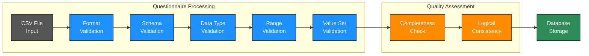

The questionnaire data validation process includes:

1. **Format Validation**: Checks file format, encoding, and structure
2. **Schema Validation**: Verifies all required columns are present
3. **Data Type Validation**: Ensures values match expected data types
4. **Range Validation**: Confirms values fall within acceptable ranges
5. **Value Set Validation**: Verifies categorical values match predefined sets
6. **Completeness Check**: Identifies missing values in required fields
7. **Logical Consistency**: Validates relationships between related fields

Files that pass all validation checks are stored in the database and made available for analysis. Files with validation errors are flagged for review and correction.

## **Mobile Measures**

Mobile measures data is collected from portable devices and undergoes validation to ensure accuracy and reliability.

#### File Format Specifications

| Specification | Requirement |
|---------------|-------------|
| **File type** | CSV (comma-separated values) |
| **Encoding** | UTF-8 |
| **Header row** | Required (first row contains column names) |
| **Delimiter** | Comma (,) |
| **Date format** | YYYY-MM-DD |
| **Time format** | HH:MM |

#### Column Specifications

The following table outlines the required columns, data types, validation rules, and units for mobile measures files:

| Column Name | Data Type | Format/Values | Validation Rules | Required | Units |
|-------------|-----------|---------------|------------------|----------|-------|
| **Measure Identifier** | String | Alphanumeric | Unique identifier for each measurement set | Yes | N/A |
| **Patient ID** | String | Alphanumeric | Identifier linking to patient record | Yes | N/A |
| **Measurement Date** | Date | YYYY-MM-DD | Valid date format | Yes | N/A |
| **Measurement Time** | Time | HH:MM | Valid time format | Yes | N/A |
| **Blood Pressure (Systolic)** | Integer | 80-150 | Number within valid range | No | mmHg |
| **Blood Pressure (Diastolic)** | Integer | 50-110 | Number within valid range | No | mmHg |
| **Pulse Rate** | Integer | 50-100 | Number within valid range | No | per minute |
| **SpO2** | Integer | 90-100 | Number within valid range | No | % |
| **Respiratory Rate** | Integer | 8-20 | Number within valid range | No | per minute |
| **Weight** | Decimal | 40.0-100.0 | Number within valid range with one decimal place | No | kg |
| **Height** | Decimal | 135.0-190.0 | Number within valid range with one decimal place | No | cm |

#### Validation Process

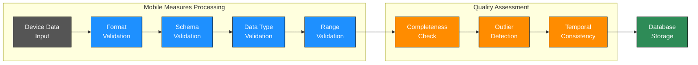

The mobile measures validation process includes:

1. **Format Validation**: Verifies data structure and identifiers
2. **Schema Validation**: Verifies all required columns are present
3. **Data Type Validation**: Ensures values match expected data types
4. **Range Validation**: Confirms values fall within physiologically plausible ranges
5. **Completeness Check**: Ensures all required measurements are present
6. **Outlier Detection**: Flags statistically abnormal values for review
7. **Temporal Consistency**: Checks for consistency across multiple measurements over time

Files that pass all validation checks are stored in the database and made available for analysis. Files with validation errors are flagged for review and correction.

## Multimodal Data

### **Echocardiogram**

For echocardiograms we will be using a combination of format checks and AI models to assess adherence to protocol and the quality of the recorded DICOM files. 

#### Format Checks

Before processing with AI models, each echocardiogram undergoes a series of standardized format checks to ensure data quality and consistency:

1. **Video and Image Resolution Check**: Verifies that the resolution meets minimum standards for accurate analysis.
2. **Image Contrast and Intensity Consistency**: Ensures proper contrast levels and consistent intensity across frames.
3. **Image Clarity and Focus Quality**: Evaluates the sharpness and focus of the ultrasound images.
4. **Motion Artifacts Check**: Identifies and flags excessive motion artifacts that could impact interpretation.
5. **Frame-to-Frame Consistency**: Ensures smooth transitions between frames without jumps or gaps.
6. **Cardiac Cycle Detection**: Verifies that complete cardiac cycles are captured for comprehensive analysis.
7. **Doppler Flow**: Checks that Doppler flow measurements are properly recorded when applicable.
8. **Anatomical View Check**: Confirms that standard anatomical views are captured according to protocol.
9. **DICOM Metadata Verification**: Validates that all required metadata fields are present and correctly formatted.
10. **Number of Videos**: Ensures the study includes all required video clips per protocol.
11. **File Integrity Check**: Verifies that DICOM files are not corrupted and can be properly read.

Files that pass these checks proceed to our AI processing pipeline, which processes echo videos through two specialized AI models:

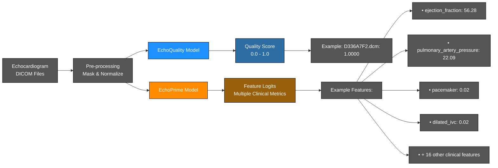

#### Model Outputs

1. **EchoQuality Model**: Returns a float-based quality score between 0.0 and 1.0, indicating the overall quality of the echocardiogram.

2. **EchoPrime Model**: Returns scores for specific clinical features, including:
   - Cardiac function metrics (e.g., ejection fraction)
   - Structural abnormalities (e.g., chamber dilation)
   - Valvular conditions (e.g., stenosis, regurgitation)
   - Implanted devices (e.g., pacemaker, mitraclip, TAVR)
   - Physiological measurements (e.g., pulmonary artery pressure)

**Testing & Training Process**

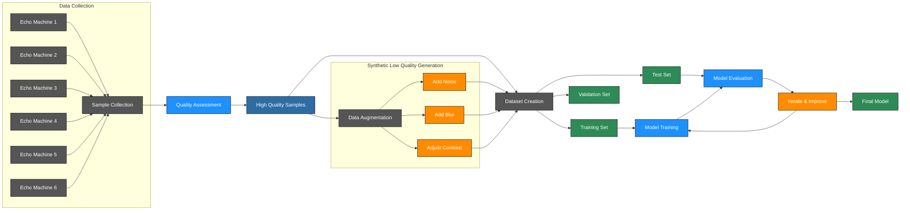

The diagram above illustrates our model training pipeline for echocardiogram analysis:

1. Get samples from all echo devices to be used in the study for post-training on EchoPrime foundational model.
2. Check all the expected metadata is available in the DICOM files or PDF reports.
3. Verify the logic responsible for pre-processing all DICOM images. This is to correctly identify and mask the ultrasound image for feature identification.
4. Verify we can normalize the PDF reports associated with the DICOM files with a high degree of accuracy. 
5. Formalize a set of high quality samples for training and process the set to create low quality samples for use in training.
6. Fine-tune EchoPrime on sets and measure results to continue iterations.

**Source Code**

[https://github.com/patniko/models.echoquality](https://github.com/patniko/models.echoquality)

[https://github.com/patniko/models.echoprime](https://github.com/patniko/models.echoprime)

### **ECG**

ECG data will be collected from a combination of 12L devices currently used in hospital systems and lower-cost ECG devices provided by AliveCor and Eko. 

#### Format Checks

Before processing with AI models, each ECG recording undergoes a series of standardized format checks to ensure data quality and consistency:

1. **Missing Leads/Incomplete Data**: Verifies that all expected leads are present and complete.
2. **Signal-to-Noise Ratio**: Measures and evaluates the signal quality relative to noise.
3. **Baseline Wander**: Checks for excessive baseline drift that could affect interpretation.
4. **Morphology Checks**: Evaluates waveform shapes with appropriate leeway to not exclude irregular rhythms.
5. **R-R Interval Consistency**: Assesses the regularity of heartbeats and identifies potential arrhythmias.
6. **QRS Detection**: Verifies that QRS complexes are properly identifiable.
7. **HRV Check**: Evaluates heart rate variability metrics for physiological plausibility.
8. **Frequency Content Analysis**: Analyzes the frequency spectrum to identify potential artifacts.
9. **Motion Artifacts/Power Line Interference**: Detects and quantifies common interference patterns.

Files that pass these checks proceed to our processing pipeline, which processes ECG signals through specialized preprocessing steps and the HuBERT-ECG foundation model for feature extraction and analysis.

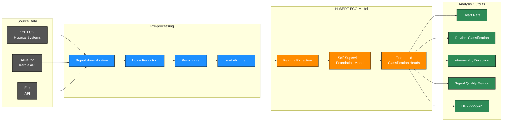

#### Data Collection & Processing

1. **Source Data Collection**:
   - 12-lead ECG data from hospital systems
   - Single-lead ECG data from AliveCor devices via Kardia API
   - ECG data from Eko devices via Eko API

2. **Pre-processing Pipeline**:
   - Signal normalization to standardize amplitude ranges
   - Noise reduction to remove baseline wander, power line interference, and motion artifacts
   - Resampling to a consistent frequency (typically 500Hz, downsampled by factor of 5)
   - Lead alignment and formatting for model input

#### HuBERT-ECG Model

We utilize the HuBERT-ECG foundation model, a self-supervised model pre-trained on a large dataset of 9.1 million 12-lead ECGs encompassing 164 cardiovascular conditions. The model architecture enables:

- Feature extraction from raw ECG signals
- Transfer learning capabilities for various downstream tasks
- Fine-tuning for specific classification tasks

#### Analysis Outputs

The ECG analysis pipeline produces several key outputs:

| Category | Outputs |
|----------|---------|
| **Basic Measurements** | • Heart rate<br>• RR interval statistics |
| **Rhythm Classification** | • Normal sinus rhythm<br>• Atrial fibrillation<br>• Other arrhythmias |
| **Abnormality Detection** | • Structural abnormalities<br>• Conduction disorders<br>• Ischemic changes |
| **Signal Quality Assessment** | • Signal-to-noise ratio<br>• Baseline wander score<br>• Motion artifact detection<br>• Missing lead identification |
| **Heart Rate Variability (HRV)** | • Time-domain metrics (SDNN, RMSSD, pNN50)<br>• Frequency-domain metrics (LF, HF, LF/HF ratio) |

#### Training & Validation Process

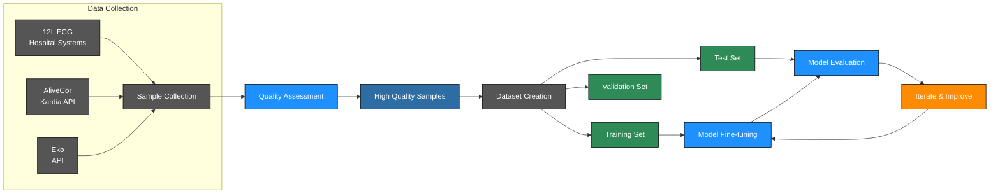

The training and validation process includes:

1. Collecting diverse ECG samples from all device types used in the study
2. Assessing data quality and ensuring consistent formatting
3. Creating balanced datasets for training, testing, and validation
4. Fine-tuning the HuBERT-ECG foundation model on our specific data
5. Evaluating model performance on test data
6. Iterating to improve performance metrics

**Access AliveCor Data**

AliveCor data is pulled through the [Kardia API](https://developers.kardia.com/#7d59a073-19e8-4144-b2bf-62b7cdcf2ee4). Run the following cURL command to get the current API token:

```bash
curl --location 'https://api.kardia.com/v1/apikey' \
--header 'Content-Type: application/x-www-form-urlencoded' \
--data-urlencode 'email=XXXXXXXX' \
--data-urlencode 'password=XXXXXXXX'
```

To call all other API’s you need to combine the api key and password values into `apikey:password` format and base64 the string. For example, to get the list of all patients you can call this API with the base64 encoded string in the authorization header.

```bash
curl --location 'https://api.kardia.com/v1/patients' \
--header 'Authorization: Basic XXXXXXX' \
--header 'Content-Type: application/x-www-form-urlencoded'
```

**Source Code**

[https://github.com/patniko/models.hubertecg](https://github.com/patniko/models.hubertecg)

### **DINO**

DINO (Asymmetric DINO V2) is a self-supervised learning framework for ECG analysis that enables diagnostic capabilities with limited lead data. The model uses a teacher-student architecture where the teacher processes comprehensive data (12-lead ECG + metadata) while the student processes only limited leads (e.g., single-lead ECG), making it ideal for point-of-care applications.

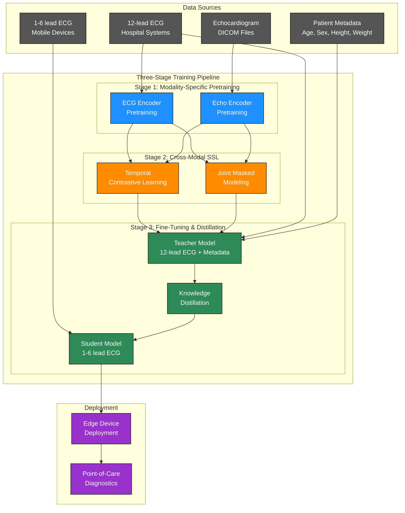

#### Three-Stage Training Pipeline

1. **Modality-Specific Pretraining**
   - Leverage large public datasets (PTB-XL, Chapman-Shaoxing, EchoNet-Dynamic)
   - Train robust ECG and echocardiogram encoders without requiring labeled data
   - Extract generalizable features using self-supervised learning techniques
   - Improve feature robustness through exposure to diverse data

2. **Cross-Modal Self-Supervised Learning**
   - Align ECG and echocardiogram embeddings to capture clinically meaningful relationships
   - Use 20,000 unlabeled patient records (12-lead ECG + echo videos + blood work)
   - Implement temporal contrastive learning to align ECG R-peaks with echo keyframes
   - Apply joint masked modeling to predict missing data using cross-attention
   - Exploit natural physiological synchrony between electrical activity and mechanical function

3. **Supervised Fine-Tuning and Knowledge Distillation**
   - Fine-tune on 5,000 high-quality labeled examples
   - Distill knowledge from the comprehensive teacher model to a lightweight student model
   - Teacher model processes 12-lead ECG + patient metadata
   - Student model processes only limited leads (1-6 lead ECG)
   - Optimize for edge device deployment with minimal performance loss

#### Metadata Integration

The DINO model incorporates patient metadata to enhance diagnostic capabilities:

- **Standard Metadata**:
  - Age (normalized by dividing by 100)
  - Sex (categorical encoding)
  - Height (normalized by dividing by 200cm)
  - Weight (normalized by dividing by 150kg)

- **Custom Metadata**:
  - Supports custom schemas for additional patient information
  - Enables integration of domain-specific knowledge

#### Performance Targets

- Teacher model: Target AUC of 0.88-0.92
- Student model: Target AUC of 0.83-0.87
- Inference latency under 50 milliseconds for edge deployment

#### Key Advantages

- Reduces dependence on expensive labeled data by 75%
- Improves generalization to rare conditions through rich representations
- Enables deployment on resource-constrained devices
- Facilitates ongoing improvement through modular design
- Bridges the gap between comprehensive hospital diagnostics and point-of-care capabilities

**Source Code**

[https://github.com/patniko/models.dino](https://github.com/patniko/models.dino)

## Open Items
- ⏳ Get CMC samples for Echo and ECG devices
- ✅ Get AliveCor API access to timeseries data
- ⏳ Get Eko API access to timeseries data
- ⏳ Resolve how to timeshift align ECG + Echo signals
- ⏸️ Parse all echo PDF formats or get structured data access
- ⏸️ Parse all 12L PDF formats or get structured timeseries data access
- ⏸️ Collate high quality sample data sets
- ⏸️ Generate low quality sample data sets
- ⏳ Validate all echo devices can be pre-processed and asessed for quality
- ⏸️ Complete small training run on DINO
- ❓ Figure out where/if we need to parse clinical notes directly
- ❓ Check with CMC to see if tabular checks can be run before de-id
- ❓ Normalize smoking years to pack years
- ❓ See if we can track unfiltered vs. filtered smoking years
- ❓ Add chewable tobacco to the list of questions. Not always smoking.
- ❓ Alcohol consumption is number of drinks per day